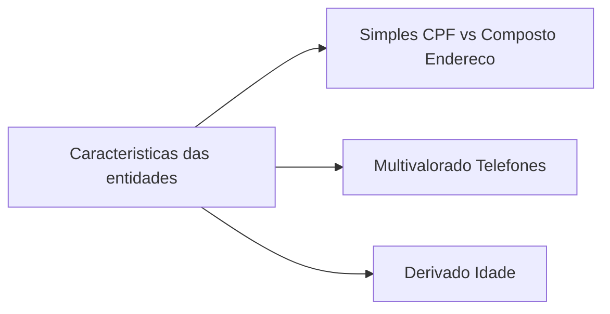

# SLIDE 4 - PILAR 2 - ATRIBUTOS E SUAS CLASSIFICAÇÕES

```mermaid
flowchart LR
    A["Caracteristicas das entidades"]
    B["Simples CPF vs Composto Endereco"]
    C["Multivalorado Telefones"]
    D["Derivado Idade"]
    A --> B
    A --> C
    A --> D
```
