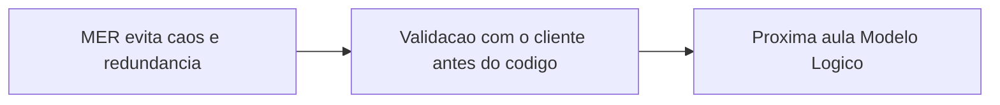

### SLIDE 10 - CONCLUSÃO E PRÓXIMOS PASSOS

```mermaid
flowchart LR
    A["MER evita caos e redundancia"]
    B["Validacao com o cliente antes do codigo"]
    C["Proxima aula Modelo Logico"]
    A --> B --> C
```
