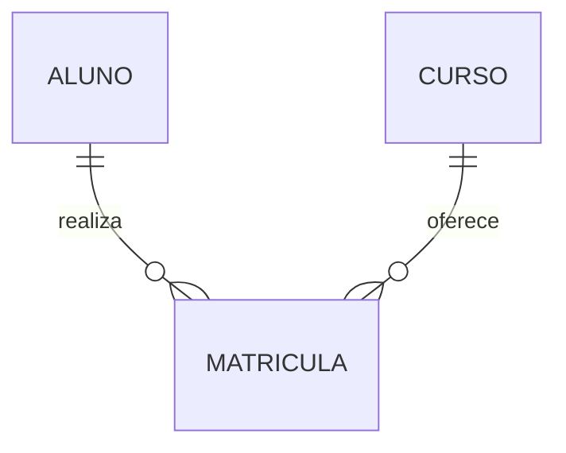
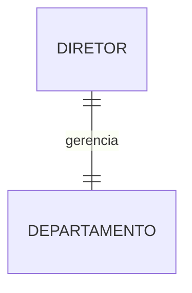
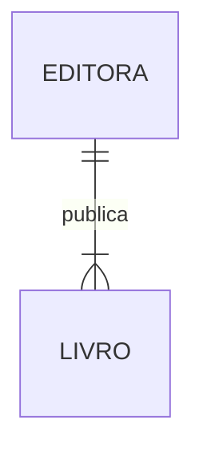
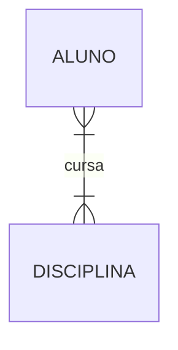
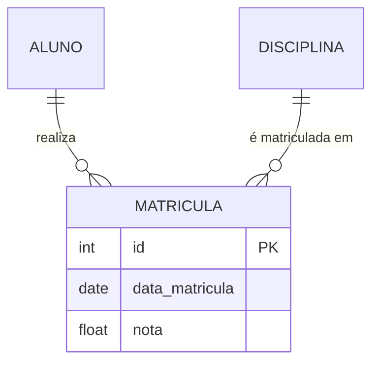

## 4. Relacionamentos e Cardinalidades

### 4.1 O Relacionamento ◊

O **relacionamento** é a associação significativa entre duas ou mais entidades. É o "verbo" que conecta os "sujeitos" do nosso modelo.

> 💡 **Dica:** Entidade = SUBSTANTIVO (Aluno, Curso). Relacionamento = VERBO (Matricula-se, Cursa).

### 4.2 Cardinalidade ()

A **cardinalidade** define as regras de negócio - quantas instâncias de uma entidade podem se relacionar com quantas instâncias de outra entidade.

#### Cardinalidade 1:1 (Um para Um)

**Exemplo:** Um diretor gerencia apenas 1 departamento, e um departamento tem apenas 1 diretor.

#### Cardinalidade 1:N (Um para Muitos)

**Exemplo:** Uma editora publica muitos livros, mas um livro pertence a uma única editora.

#### Cardinalidade N:M (Muitos para Muitos)

**Exemplo:** Um aluno cursa várias disciplinas, e uma disciplina tem vários alunos.

> ️ **Atenção:** No modelo lógico/físico, relacionamentos N:M precisam de uma **entidade associativa**!

### 4.3 Entidade Associativa

Quando temos um relacionamento N:M, criamos uma entidade associativa para transformá-lo em dois relacionamentos 1:N.

**Explicação:** A entidade `MATRICULA` associa `ALUNO` e `DISCIPLINA`, e pode ter atributos próprios como `data_matricula` e `nota`.
