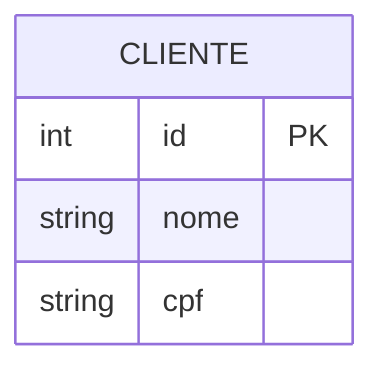
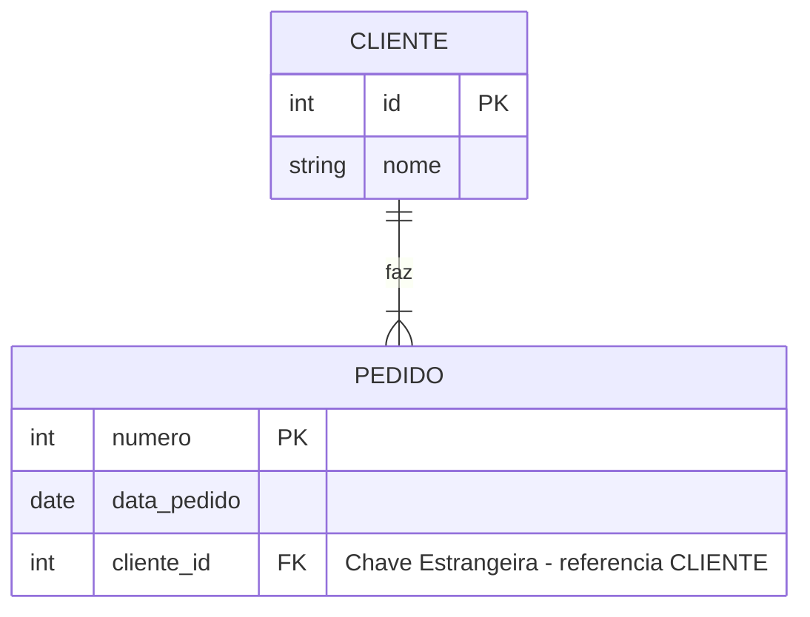
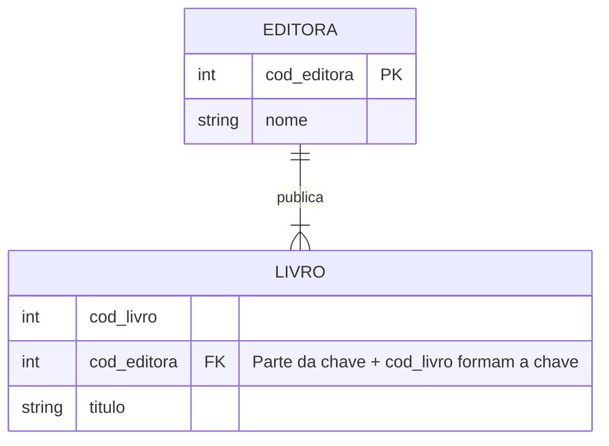

## 5. Chaves: Primária e Estrangeira

### 5.1 Chave Primária (PK) ●

Já vimos: é o identificador único da entidade.

### 5.2 Chave Estrangeira (FK)

A **chave estrangeira** (Foreign Key) é o atributo que faz referência à chave primária de outra entidade. É o "elo de ligação" que materializa o relacionamento.

> 💡 **Analogia:** Se a Chave Primária é a identidade da entidade, a Chave Estrangeira é o "endereço" que nos diz onde encontrar a entidade relacionada.

### 5.3 Entidades Fracas e Chaves

Entidades fracas recebem a chave primária da entidade forte como parte de sua própria chave.

