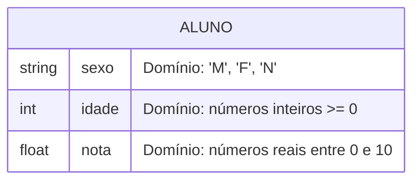
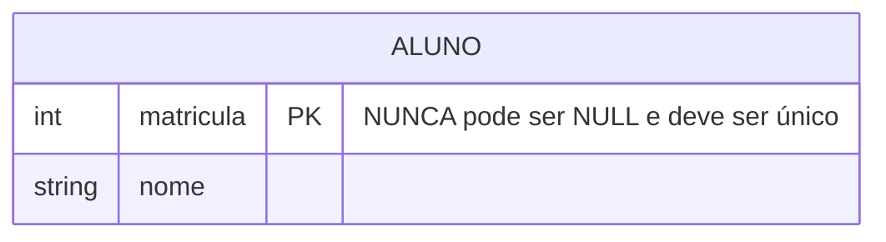
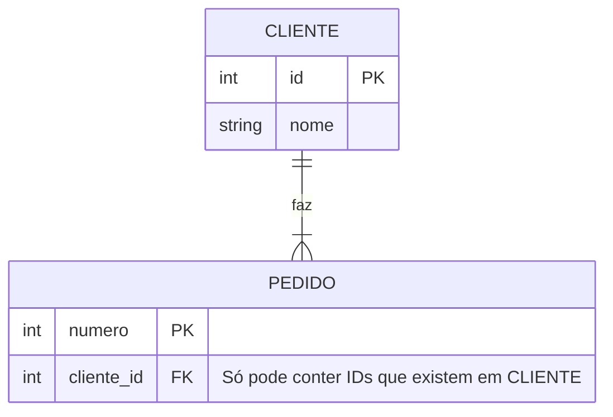

## 6. Domínio e Regras de Integridade

### 6.1 Domínio de Atributos

O **domínio** é o conjunto de todos os valores válidos que um atributo pode assumir.

>  **Exemplo:** O domínio do atributo `sexo` pode ser restrito a {'M', 'F', 'N'}. Não podemos armazenar "ABC" nesse campo!

### 6.2 Regras de Integridade

#### Integridade de Entidade
- A **Chave Primária** nunca pode ser nula (vazia)
- A **Chave Primária** deve ser única

#### Integridade Referencial
- Uma **Chave Estrangeira** só pode conter valores que já existem na Chave Primária da tabela de origem
- Ou ser nula (se a regra de negócio permitir)

> 💡 **Analogia:** As regras de integridade são os "fiscais" do banco de dados. Elas impedem que o sistema aceite um pedido de compra de um cliente que não existe!
