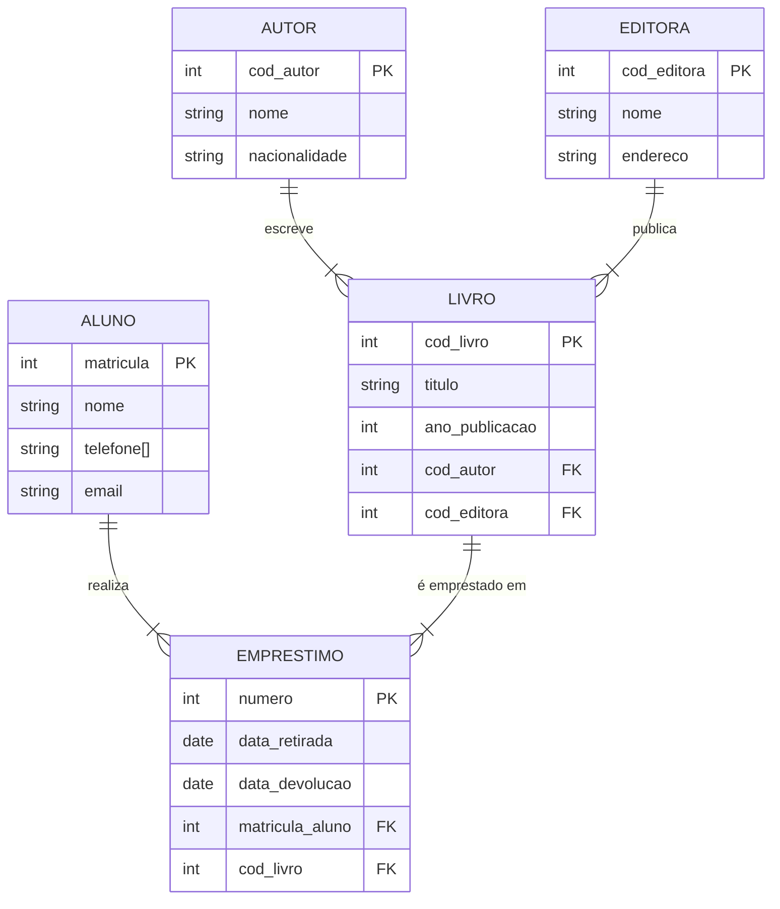
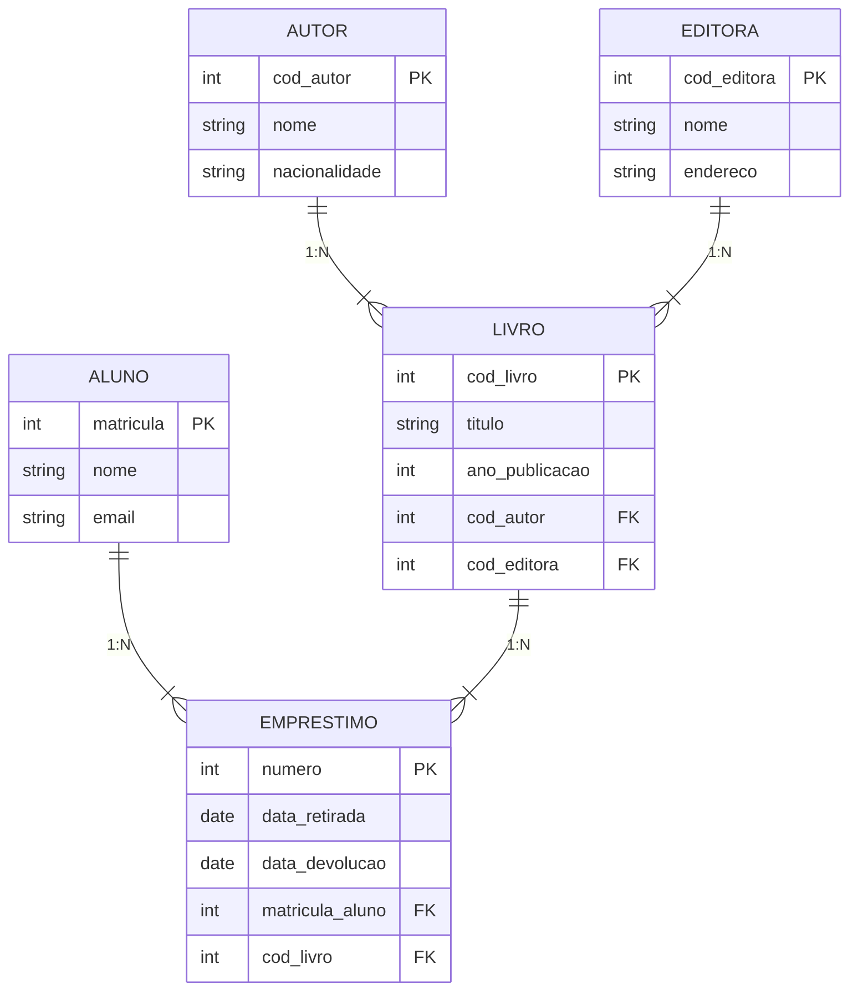

## 7. Exemplo Prático: Transformando MER em Modelo Lógico

### Cenário: Sistema de Biblioteca

Vamos criar um modelo conceitual e transformá-lo em modelo lógico (tabelas).

### Passo 1: Modelo Conceitual (MER)

### Passo 2: Transformação em Modelo Lógico (Tabelas)

Agora vamos transformar cada entidade em uma **tabela**, seguindo estas regras:

#### Regras de Transformação:

1. **Cada entidade vira uma tabela**
2. **Cada atributo vira uma coluna**
3. **A chave primária (PK) é mantida**
4. **Os relacionamentos 1:N viram chaves estrangeiras (FK)**
5. **Os relacionamentos N:M viram tabelas associativas**

### Passo 3: Estrutura das Tabelas

#### Tabela: AUTOR

| Coluna | Tipo | Restrição |
|--------|------|-----------|
| cod_autor | INT | PRIMARY KEY |
| nome | VARCHAR(100) | NOT NULL |
| nacionalidade | VARCHAR(50) | - |

#### Tabela: EDITORA

| Coluna | Tipo | Restrição |
|--------|------|-----------|
| cod_editora | INT | PRIMARY KEY |
| nome | VARCHAR(100) | NOT NULL |
| endereco | VARCHAR(200) | - |

#### Tabela: LIVRO

| Coluna | Tipo | Restrição |
|--------|------|-----------|
| cod_livro | INT | PRIMARY KEY |
| titulo | VARCHAR(150) | NOT NULL |
| ano_publicacao | INT | - |
| cod_autor | INT | FOREIGN KEY → AUTOR(cod_autor) |
| cod_editora | INT | FOREIGN KEY → EDITORA(cod_editora) |

**Explicação:** 
- `cod_autor` e `cod_editora` são **chaves estrangeiras** que referenciam as tabelas AUTOR e EDITORA
- Isso representa os relacionamentos 1:N (um autor escreve muitos livros, uma editora publica muitos livros)

#### Tabela: ALUNO

| Coluna | Tipo | Restrição |
|--------|------|-----------|
| matricula | INT | PRIMARY KEY |
| nome | VARCHAR(100) | NOT NULL |
| email | VARCHAR(100) | - |

**Nota:** O atributo multivalorado `telefone[]` precisaria de uma tabela separada (TELEFONE_ALUNO) no modelo lógico completo.

#### Tabela: EMPRESTIMO

| Coluna | Tipo | Restrição |
|--------|------|-----------|
| numero | INT | PRIMARY KEY |
| data_retirada | DATE | NOT NULL |
| data_devolucao | DATE | - |
| matricula_aluno | INT | FOREIGN KEY → ALUNO(matricula) |
| cod_livro | INT | FOREIGN KEY → LIVRO(cod_livro) |

**Explicação:**
- `matricula_aluno` referencia o aluno que fez o empréstimo
- `cod_livro` referencia o livro emprestado
- Isso representa o relacionamento entre ALUNO e LIVRO

### Passo 4: Visualização do Modelo Lógico

### Resumo da Transformação

| Elemento do MER            | Elemento no Modelo Lógico         |
| -------------------------- | --------------------------------- |
| Entidade                   | Tabela                            |
| Atributo                   | Coluna                            |
| Chave Primária (●)         | PRIMARY KEY                       |
| Relacionamento 1:N         | FOREIGN KEY na tabela do lado "N" |
| Relacionamento N:M         | Tabela associativa com duas FKs   |
| Atributo Multivalorado (△) | Tabela separada                   |
