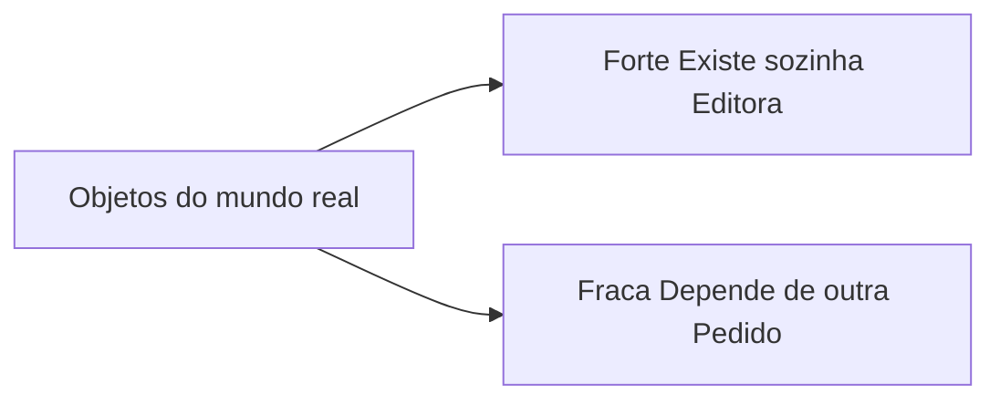

# SLIDE 3 - PILAR 1 - ENTIDADE (FORTE vs. FRACA)

```mermaid
flowchart LR
    A["Objetos do mundo real"]
    B["Forte Existe sozinha Editora"]
    C["Fraca Depende de outra Pedido"]
    A --> B
    A --> C
```
