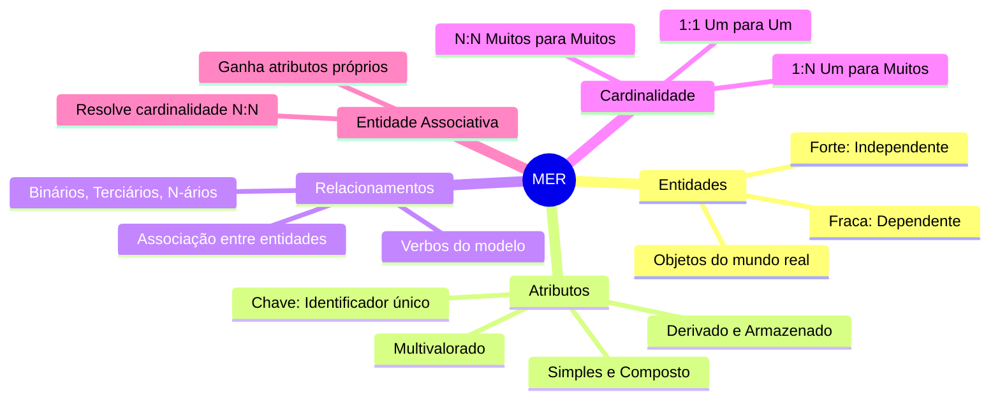

## MAPA MENTAL MER

```mermaid
mindmap
  root((MER))
    Entidades
      Objetos do mundo real
      Forte: Independente
      Fraca: Dependente
    Atributos
      Simples e Composto
      Multivalorado
      Derivado e Armazenado
      Chave: Identificador único
    Relacionamentos
      Associação entre entidades
      Verbos do modelo
      Binários, Terciários, N-ários
    Cardinalidade
      1:1 Um para Um
      1:N Um para Muitos
      N:N Muitos para Muitos
    Entidade Associativa
      Resolve cardinalidade N:N
      Ganha atributos próprios
```

