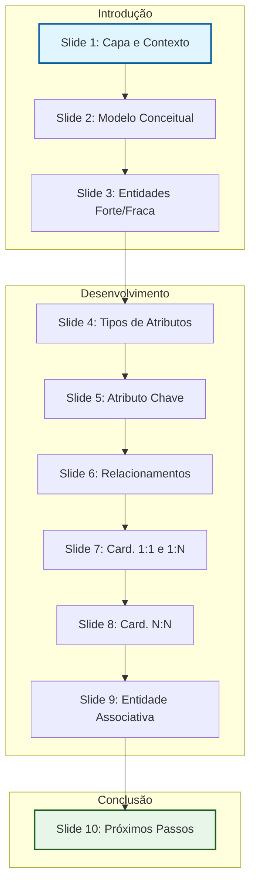

### EXTRUTURA DOS SLIDES

```mermaid
graph TD
    subgraph Introdução
        S1[Slide 1: Capa e Contexto] --> S2[Slide 2: Modelo Conceitual]
        S2 --> S3[Slide 3: Entidades Forte/Fraca]
    end
    
    subgraph Desenvolvimento
        S3 --> S4[Slide 4: Tipos de Atributos]
        S4 --> S5[Slide 5: Atributo Chave]
        S5 --> S6[Slide 6: Relacionamentos]
        S6 --> S7[Slide 7: Card. 1:1 e 1:N]
        S7 --> S8[Slide 8: Card. N:N]
        S8 --> S9[Slide 9: Entidade Associativa]
    end
    
    subgraph Conclusão
        S9 --> S10[Slide 10: Próximos Passos]
    end
    
    style S1 fill:#e1f5fe,stroke:#01579b,stroke-width:2px
    style S10 fill:#e8f5e9,stroke:#1b5e20,stroke-width:2px
```
