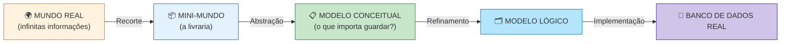
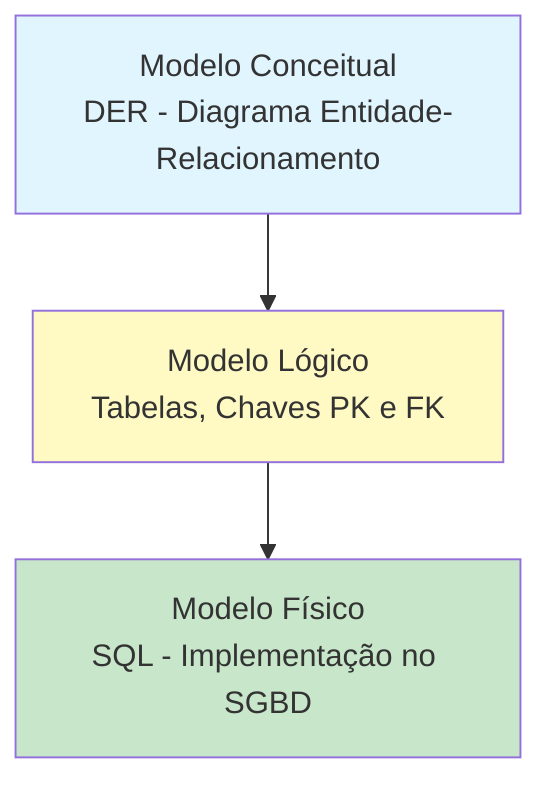

## 2. CONCEITOS FUNDAMENTAIS
## 2.1 Mini-Mundo

O **mini-mundo** é um recorte da realidade que queremos representar no sistema. Não precisamos modelar o mundo todo, apenas o que interessa ao negócio.

**Exemplo:** Em um sistema escolar, nosso mini-mundo inclui alunos, professores, disciplinas e notas. Não inclui o clima, o preço do pão na padaria ou o trânsito da cidade.

---

## 2.2 Abstração

**Abstração** é o processo de ignorar detalhes irrelevantes e focar nas características essenciais dos objetos.

> 💡 **Pense assim:** Um mapa de metrô não mostra cada árvore ou prédio da cidade. Ele abstrai a realidade para mostrar apenas estações e linhas. O modelo de dados faz o mesmo!

---

## 2.3 Os Três Níveis de Modelagem
| Nível                       | Pergunta que responde                 | Quem entende            | Linguagem               |
| --------------------------- | ------------------------------------- | ----------------------- | ----------------------- |
| **Conceitual** (alto nível) | *"O QUE o sistema guarda?"*           | Cliente, analista, você | Diagramas, português    |
| **Lógico** (intermediário)  | *"COMO os dados estão estruturados?"* | Analista, desenvolvedor | Tabelas, chaves, regras |
| **Físico** (baixo nível)    | *"COMO fica no computador?"*          | SGBD, DBA               | **SQL**                 |

**Fluxo:** Conceitual (o QUÊ) → Lógico (o COMO) → Físico (a IMPLEMENTAÇÃO)

> 📌 O **modelo conceitual** é de alto nível — próximo da linguagem humana. O **modelo físico** é de baixo nível — próximo da linguagem da máquina, escrito em **SQL**. Entre eles, quem gerencia tudo é o **SGBD** (Sistema Gerenciador de Banco de Dados), como MySQL, PostgreSQL e Oracle 【turn0fetch0】.

## 2.4 MER e DER — QUAL A DIFERENÇA?

| Sigla   | Nome                             | O que é                                                    |
| ------- | -------------------------------- | ---------------------------------------------------------- |
| **MER** | Modelo Entidade-Relacionamento   | O **modelo** — conjunto de conceitos e regras              |
| **DER** | Diagrama Entidade-Relacionamento | O **desenho** — representação gráfica do MER 【turn0fetch0】 |

> 🎓 **Analogia**: MER é o "projeto" e DER é o "desenho do projeto no papel". Na prática usamos os termos de forma próxima, mas em prova essa diferença cai!

---

## 2.5 NOTAÇÕES DE DIAGRAMAS ER 🎨

O mesmo modelo pode ser **desenhado** de formas diferentes — o que muda é a **notação**, nunca os conceitos:

| Notação                         | Entidade               | Relacionamento  | Cardinalidade                | Onde é usada                            |
| ------------------------------- | ---------------------- | --------------- | ---------------------------- | --------------------------------------- |
| **Chen**                        | Retângulo ▢            | Losango ◊       | Números nas linhas (1, N)    | Academia, concursos, BrModelo           |
| **Pé de Galinha (Crow's Foot)** | Retângulo              | Sem losango     | Símbolos nas pontas (‖, o{)  | Mercado de trabalho, Mermaid, Workbench |
| **UML (diagrama de classes)**   | Retângulo com divisões | Linha com setas | Multiplicidades (1..*, 0..*) | Desenvolvimento de software OO          |

**Os símbolos da notação de Chen que usaremos:**

| Símbolo | Nome               | Função                                                           |
| :-----: | ------------------ | ---------------------------------------------------------------- |
|    ▢    | Retângulo          | Entidade                                                         |
|    ◊    | Losango            | Relacionamento                                                   |
|    ↝    | Linhas             | Ligam entidades aos relacionamentos                              |
|   𐤏    | Oval               | Atributo                                                         |
|    △    | Triângulo          | Atributo multivalorado **ou** generalização (ver Unidades 3 e 8) |
|    ●    | Círculo preenchido | Chave primária                                                   |

> 💡 **Dica do Professor**: nesta apostila usamos as duas principais! Os diagramas de fluxo seguem a lógica de **Chen** (boa para provas) e os `erDiagram` do Mermaid seguem o **Pé de Galinha** (boa para o mercado). Os conceitos são os mesmos — aprenda a "traduzir" entre elas.

