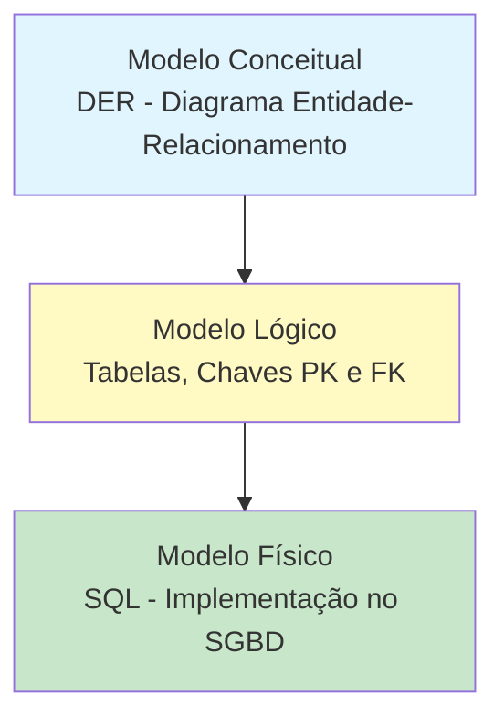

## 2. Conceitos Fundamentais

### 2.1 Mini-Mundo (Universo de Discurso)

O **mini-mundo** é um recorte da realidade que queremos representar no sistema. Não precisamos modelar o mundo todo, apenas o que interessa ao negócio.

**Exemplo:** Em um sistema escolar, nosso mini-mundo inclui alunos, professores, disciplinas e notas. Não inclui o clima, o preço do pão na padaria ou o trânsito da cidade.

### 2.2 Abstração

**Abstração** é o processo de ignorar detalhes irrelevantes e focar nas características essenciais dos objetos.

> 💡 **Pense assim:** Um mapa de metrô não mostra cada árvore ou prédio da cidade. Ele abstrai a realidade para mostrar apenas estações e linhas. O modelo de dados faz o mesmo!

### 2.3 Os Três Níveis de Modelagem

**Fluxo:** Conceitual (o QUÊ) → Lógico (o COMO) → Físico (a IMPLEMENTAÇÃO)
