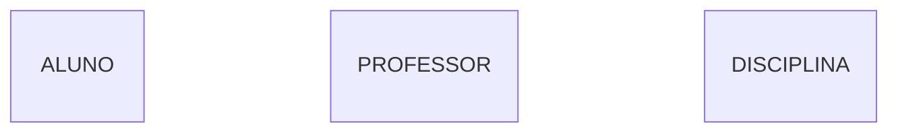
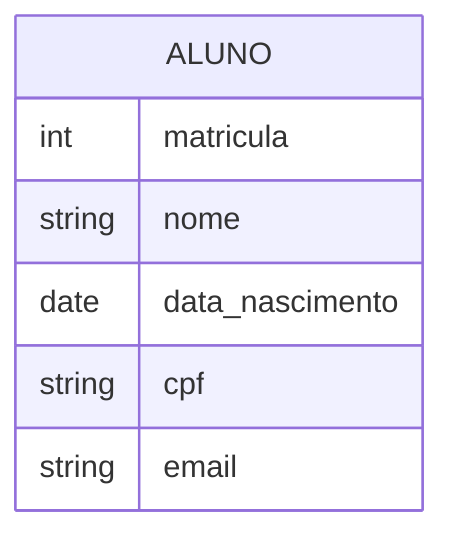
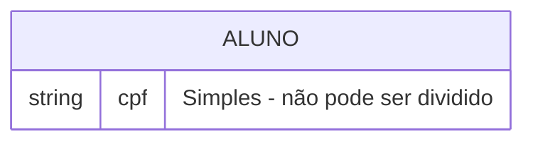
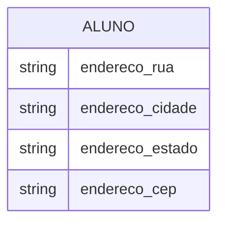
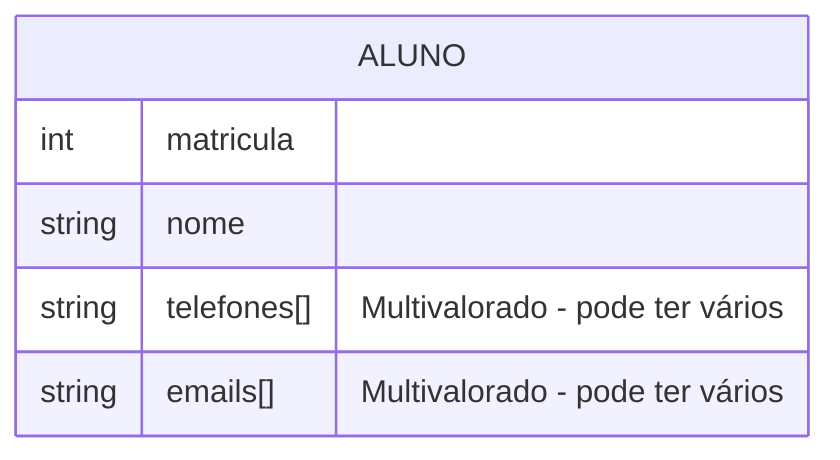
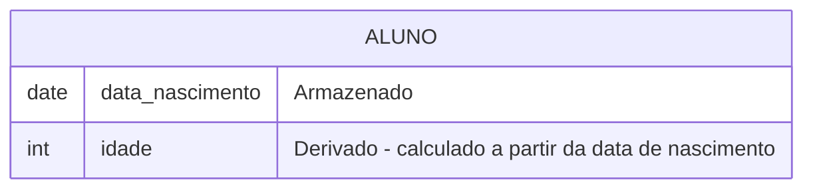
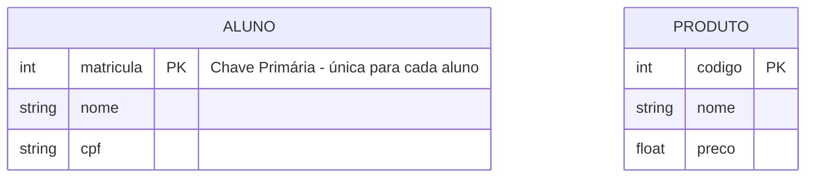

## 3. Entidades e Atributos

### 3.1 Entidade ▢

A **entidade** representa um conjunto de objetos do mundo real (pessoas, coisas, conceitos) sobre os quais queremos armazenar informações.

**Características:**
- Representada por um **retângulo** no DER
- Nomeada no **singular** e em **letras maiúsculas**
- Pode ser **Forte** (existência independente) ou **Fraca** (depende de outra entidade)

> 💡 **Dica:** Pense em entidade como um **conjunto** na matemática. "ALUNO" é o conjunto de todos os alunos da escola.

---

### 3.2 Atributos 𐤏

Os **atributos** são as características que descrevem uma entidade. No banco de dados, eles se tornam as **colunas** das tabelas.

### 3.3 Tipos de Atributos

#### Atributo Simples
Não pode ser dividido em partes menores.

#### Atributo Composto
Pode ser dividido em partes menores.

#### Atributo Multivalorado △
Pode ter vários valores para uma mesma entidade.

> 💡 **Exemplo prático:** Uma pessoa pode ter telefone residencial, celular e comercial. Por isso, "telefone" é multivalorado.

#### Atributo Derivado
Seu valor é calculado a partir de outro atributo.

### 3.4 Chave Primária ●

A **chave primária** (Primary Key - PK) é o atributo que identifica **exclusivamente** cada instância da entidade.

> 💡 **Regra de Ouro:** Toda entidade forte PRECISA de uma chave primária. Ela é como o CPF da entidade - não pode ser nula e deve ser única!
