## 3. Entidades e Atributos

### 3.1 Entidade ▢

A **entidade** representa um conjunto de objetos do mundo real (pessoas, coisas, conceitos) sobre os quais queremos armazenar informações.

**Características:**
- Representada por um **retângulo** no DER
- Nomeada no **singular** e em **letras maiúsculas**
- Pode ser **Forte** (existência independente) ou **Fraca** (depende de outra entidade)

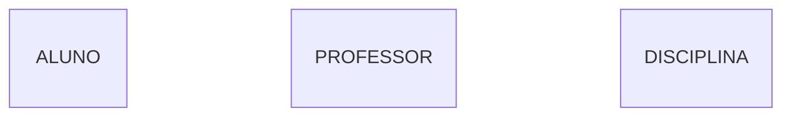

> 💡 **Dica:** Pense em entidade como um **conjunto** na matemática. "ALUNO" é o conjunto de todos os alunos da escola.

### 3.2 Atributos 𐤏

Os **atributos** são as características que descrevem uma entidade. No banco de dados, eles se tornam as **colunas** das tabelas.

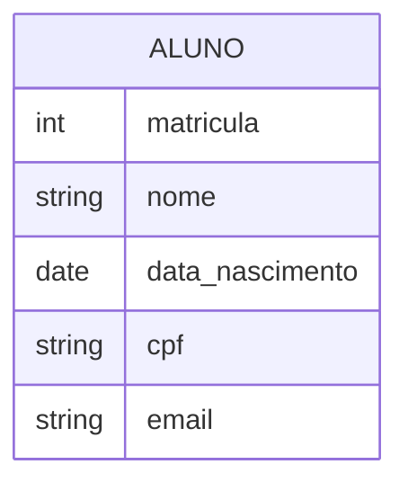

### 3.3 Tipos de Atributos

#### Atributo Simples
Não pode ser dividido em partes menores.

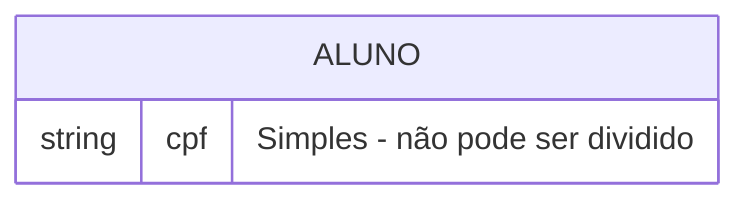

#### Atributo Composto
Pode ser dividido em partes menores.

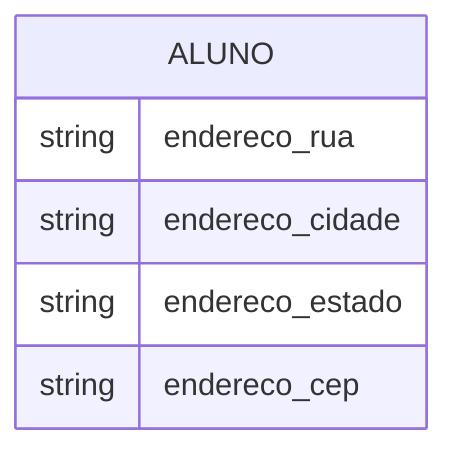

#### Atributo Multivalorado △
Pode ter vários valores para uma mesma entidade.

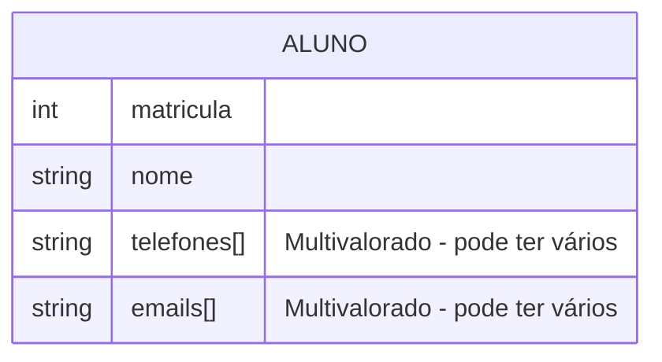

> 💡 **Exemplo prático:** Uma pessoa pode ter telefone residencial, celular e comercial. Por isso, "telefone" é multivalorado.

#### Atributo Derivado
Seu valor é calculado a partir de outro atributo.

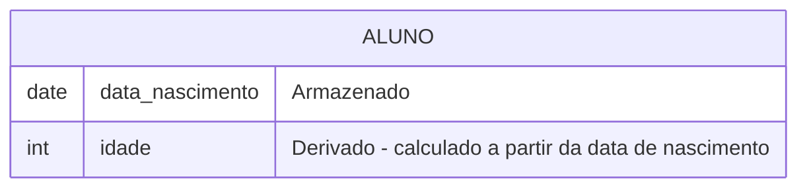

### 3.4 Chave Primária ●

A **chave primária** (Primary Key - PK) é o atributo que identifica **exclusivamente** cada instância da entidade.

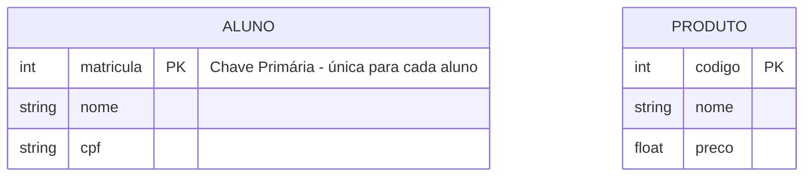

> 💡 **Regra de Ouro:** Toda entidade forte PRECISA de uma chave primária. Ela é como o CPF da entidade - não pode ser nula e deve ser única!

---

## 4. Relacionamentos e Cardinalidades

### 4.1 O Relacionamento ◊

O **relacionamento** é a associação significativa entre duas ou mais entidades. É o "verbo" que conecta os "sujeitos" do nosso modelo.

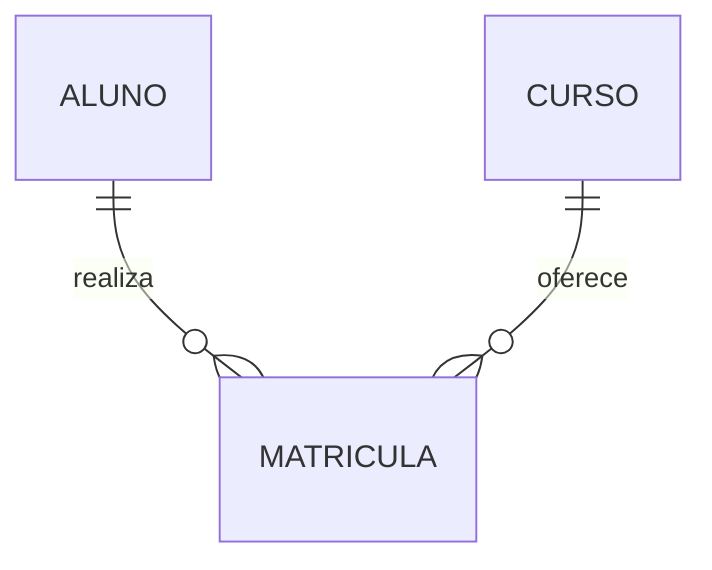

> 💡 **Dica:** Entidade = SUBSTANTIVO (Aluno, Curso). Relacionamento = VERBO (Matricula-se, Cursa).

### 4.2 Cardinalidade ()

A **cardinalidade** define as regras de negócio - quantas instâncias de uma entidade podem se relacionar com quantas instâncias de outra entidade.

#### Cardinalidade 1:1 (Um para Um)

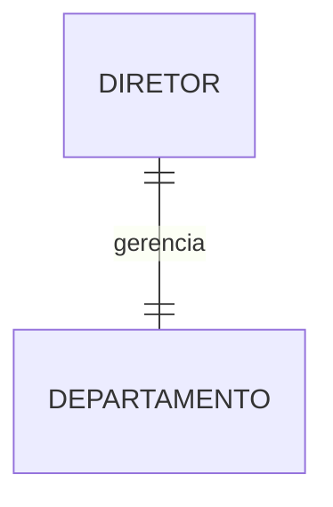

**Exemplo:** Um diretor gerencia apenas 1 departamento, e um departamento tem apenas 1 diretor.

#### Cardinalidade 1:N (Um para Muitos)

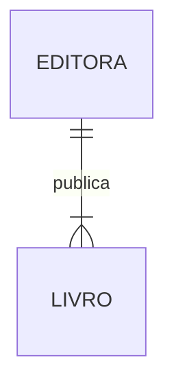

**Exemplo:** Uma editora publica muitos livros, mas um livro pertence a uma única editora.

#### Cardinalidade N:M (Muitos para Muitos)

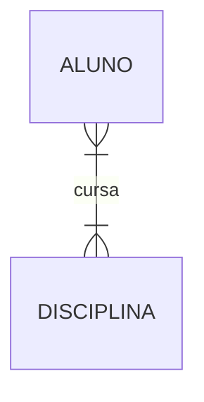

**Exemplo:** Um aluno cursa várias disciplinas, e uma disciplina tem vários alunos.

> ️ **Atenção:** No modelo lógico/físico, relacionamentos N:M precisam de uma **entidade associativa**!

### 4.3 Entidade Associativa

Quando temos um relacionamento N:M, criamos uma entidade associativa para transformá-lo em dois relacionamentos 1:N.

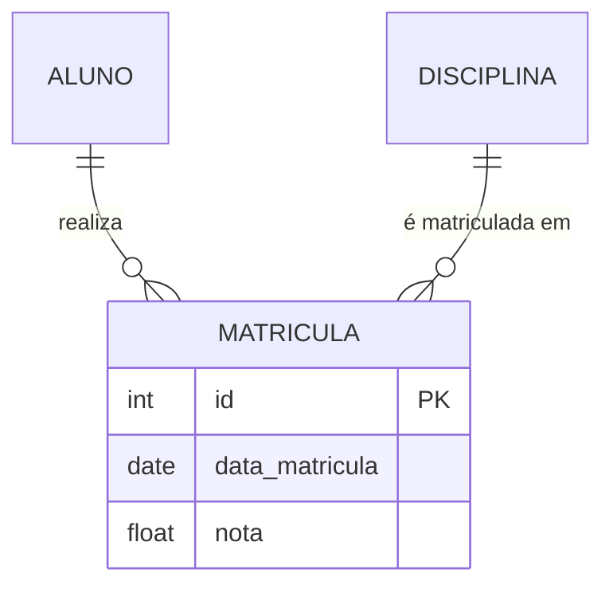

**Explicação:** A entidade `MATRICULA` associa `ALUNO` e `DISCIPLINA`, e pode ter atributos próprios como `data_matricula` e `nota`.

---

## 5. Chaves: Primária e Estrangeira

### 5.1 Chave Primária (PK) ●

Já vimos: é o identificador único da entidade.

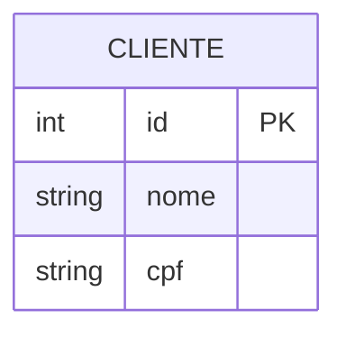

### 5.2 Chave Estrangeira (FK)

A **chave estrangeira** (Foreign Key) é o atributo que faz referência à chave primária de outra entidade. É o "elo de ligação" que materializa o relacionamento.

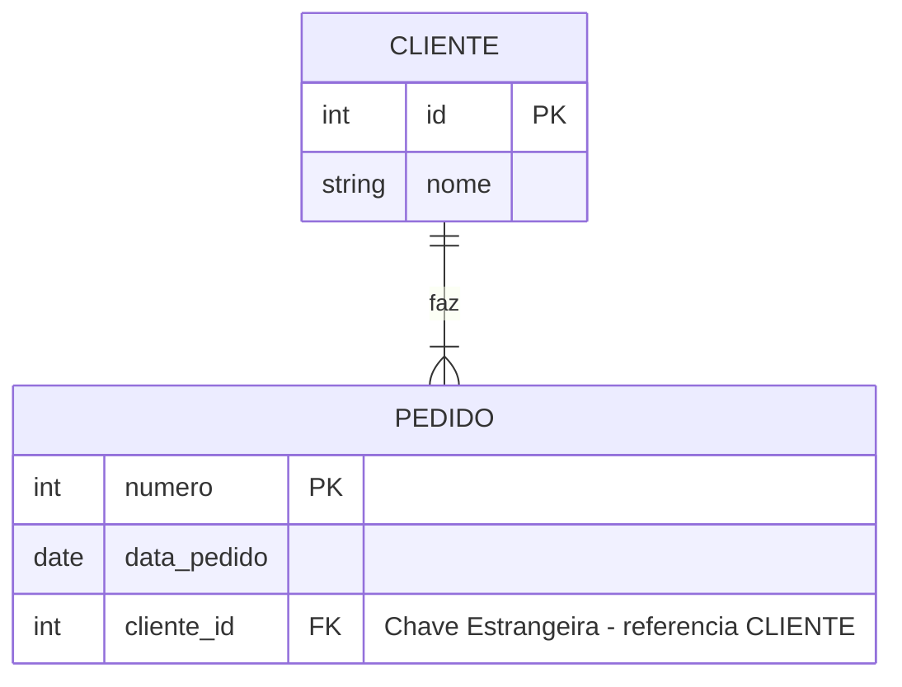

> 💡 **Analogia:** Se a Chave Primária é a identidade da entidade, a Chave Estrangeira é o "endereço" que nos diz onde encontrar a entidade relacionada.

### 5.3 Entidades Fracas e Chaves

Entidades fracas recebem a chave primária da entidade forte como parte de sua própria chave.

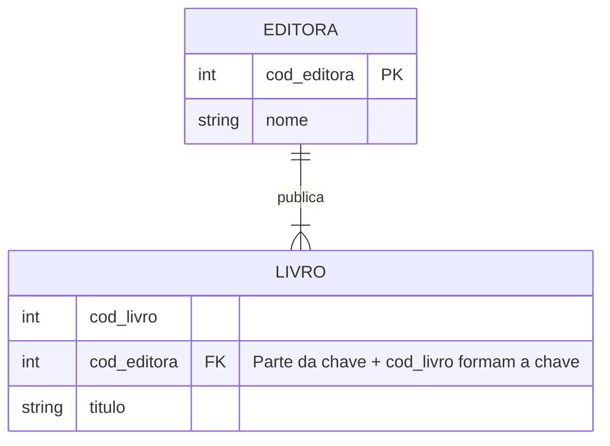

---

## 6. Domínio e Regras de Integridade

### 6.1 Domínio de Atributos

O **domínio** é o conjunto de todos os valores válidos que um atributo pode assumir.

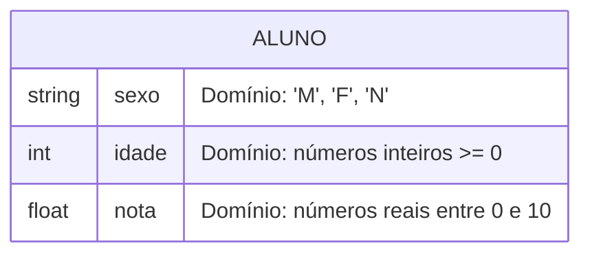

>  **Exemplo:** O domínio do atributo `sexo` pode ser restrito a {'M', 'F', 'N'}. Não podemos armazenar "ABC" nesse campo!

### 6.2 Regras de Integridade

#### Integridade de Entidade
- A **Chave Primária** nunca pode ser nula (vazia)
- A **Chave Primária** deve ser única

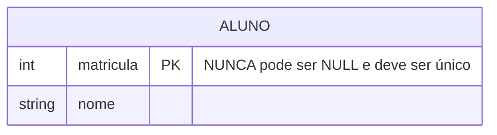

#### Integridade Referencial
- Uma **Chave Estrangeira** só pode conter valores que já existem na Chave Primária da tabela de origem
- Ou ser nula (se a regra de negócio permitir)

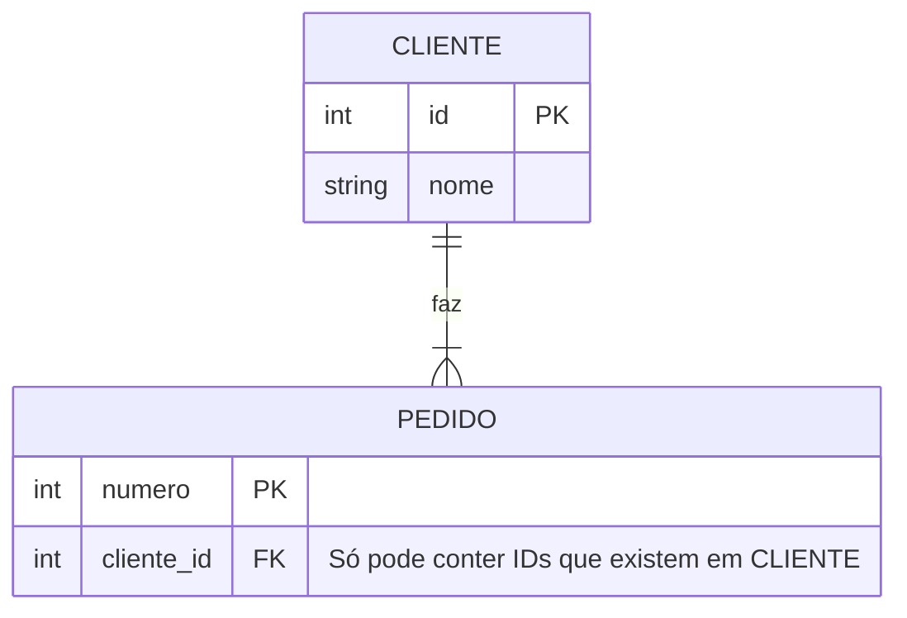

> 💡 **Analogia:** As regras de integridade são os "fiscais" do banco de dados. Elas impedem que o sistema aceite um pedido de compra de um cliente que não existe!

---

## 7. Exemplo Prático: Transformando MER em Modelo Lógico

### Cenário: Sistema de Biblioteca

Vamos criar um modelo conceitual e transformá-lo em modelo lógico (tabelas).

### Passo 1: Modelo Conceitual (MER)

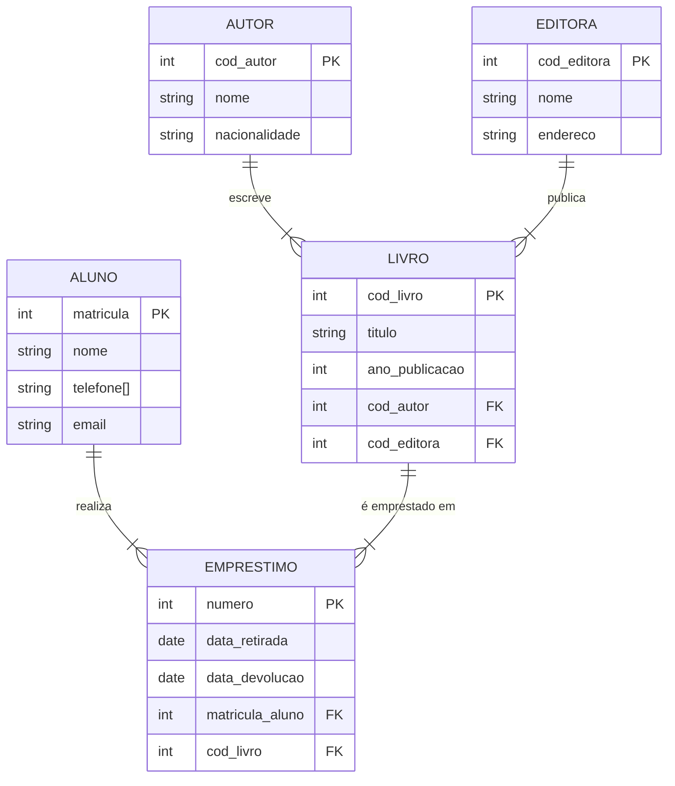

### Passo 2: Transformação em Modelo Lógico (Tabelas)

Agora vamos transformar cada entidade em uma **tabela**, seguindo estas regras:

#### Regras de Transformação:

1. **Cada entidade vira uma tabela**
2. **Cada atributo vira uma coluna**
3. **A chave primária (PK) é mantida**
4. **Os relacionamentos 1:N viram chaves estrangeiras (FK)**
5. **Os relacionamentos N:M viram tabelas associativas**

### Passo 3: Estrutura das Tabelas

#### Tabela: AUTOR

| Coluna | Tipo | Restrição |
|--------|------|-----------|
| cod_autor | INT | PRIMARY KEY |
| nome | VARCHAR(100) | NOT NULL |
| nacionalidade | VARCHAR(50) | - |

#### Tabela: EDITORA

| Coluna | Tipo | Restrição |
|--------|------|-----------|
| cod_editora | INT | PRIMARY KEY |
| nome | VARCHAR(100) | NOT NULL |
| endereco | VARCHAR(200) | - |

#### Tabela: LIVRO

| Coluna | Tipo | Restrição |
|--------|------|-----------|
| cod_livro | INT | PRIMARY KEY |
| titulo | VARCHAR(150) | NOT NULL |
| ano_publicacao | INT | - |
| cod_autor | INT | FOREIGN KEY → AUTOR(cod_autor) |
| cod_editora | INT | FOREIGN KEY → EDITORA(cod_editora) |

**Explicação:** 
- `cod_autor` e `cod_editora` são **chaves estrangeiras** que referenciam as tabelas AUTOR e EDITORA
- Isso representa os relacionamentos 1:N (um autor escreve muitos livros, uma editora publica muitos livros)

#### Tabela: ALUNO

| Coluna | Tipo | Restrição |
|--------|------|-----------|
| matricula | INT | PRIMARY KEY |
| nome | VARCHAR(100) | NOT NULL |
| email | VARCHAR(100) | - |

**Nota:** O atributo multivalorado `telefone[]` precisaria de uma tabela separada (TELEFONE_ALUNO) no modelo lógico completo.

#### Tabela: EMPRESTIMO

| Coluna | Tipo | Restrição |
|--------|------|-----------|
| numero | INT | PRIMARY KEY |
| data_retirada | DATE | NOT NULL |
| data_devolucao | DATE | - |
| matricula_aluno | INT | FOREIGN KEY → ALUNO(matricula) |
| cod_livro | INT | FOREIGN KEY → LIVRO(cod_livro) |

**Explicação:**
- `matricula_aluno` referencia o aluno que fez o empréstimo
- `cod_livro` referencia o livro emprestado
- Isso representa o relacionamento entre ALUNO e LIVRO

### Passo 4: Visualização do Modelo Lógico

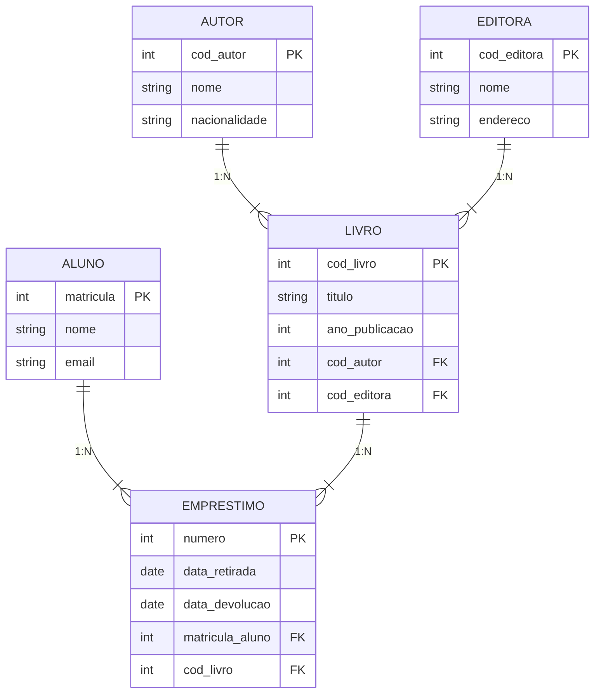

### Resumo da Transformação

| Elemento do MER            | Elemento no Modelo Lógico         |
| -------------------------- | --------------------------------- |
| Entidade                   | Tabela                            |
| Atributo                   | Coluna                            |
| Chave Primária (●)         | PRIMARY KEY                       |
| Relacionamento 1:N         | FOREIGN KEY na tabela do lado "N" |
| Relacionamento N:M         | Tabela associativa com duas FKs   |
| Atributo Multivalorado (△) | Tabela separada                   |
