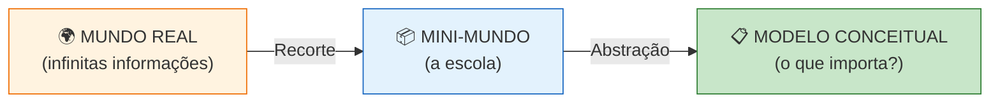
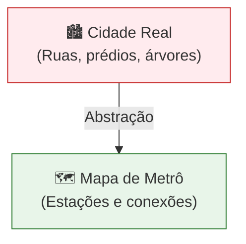
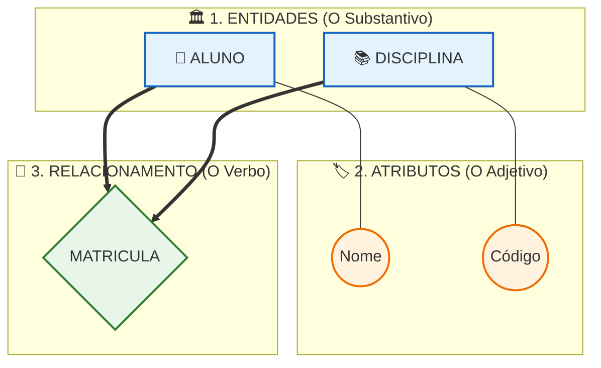
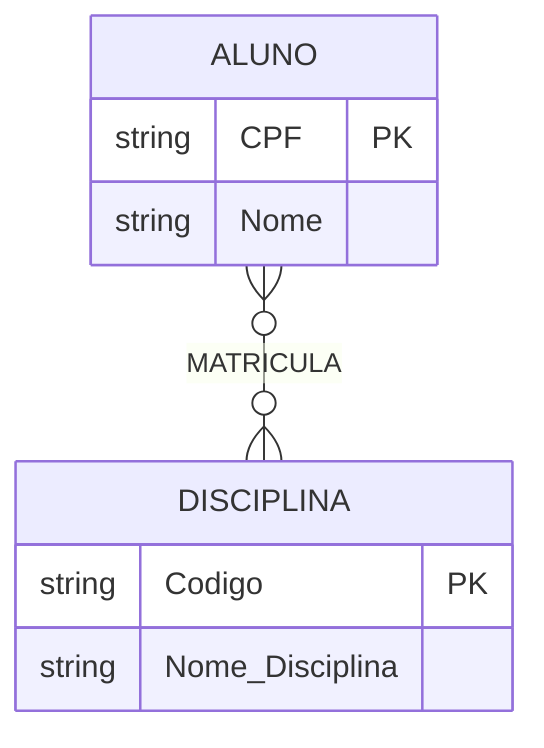

## 📚 CONCEITOS BÁSICOS DE MER PARA CRIAÇÃO DE MODELAGEM DE DADOS

### 🌍 INTRODUÇÃO

A criação de um banco de dados eficiente não começa pela digitação de comandos no computador, mas sim pelo planejamento cuidadoso das informações. Imagine tentar construir uma casa sem uma planta baixa: o resultado seria caos e falhas estruturais. A modelagem de dados cumpre exatamente o papel dessa planta.

O ponto de partida é o conceito de **mini-mundo**. Ele é um recorte intencional da realidade, contendo apenas os fatos e objetos relevantes para o negócio. Em um sistema escolar, por exemplo, modelamos alunos e disciplinas, ignorando completamente informações irrelevantes como o clima ou o preço dos alimentos.

Para transformar essa realidade em um modelo gerenciável, utilizamos a **abstração**. Abstrair significa ignorar detalhes supérfluos e focar nas características essenciais. Assim como um mapa de metrô não desenha cada prédio da cidade, mas apenas as estações e conexões, o modelo de dados simplifica a realidade.

---

### 🏗️ DESENVOLVIMENTO

#### Os Três Níveis de Modelagem
A modelagem é dividida em três níveis que guiam o projeto do conceito à implementação:

| Nível | Pergunta que responde | Quem entende | Linguagem |
| :--- | :--- | :--- | :--- |
| **Conceitual** | *"O QUE o sistema guarda?"* | Cliente, analista | Diagramas, português |
| **Lógico** | *"COMO os dados estão estruturados?"* | Analista, dev | Tabelas, chaves, regras |
| **Físico** | *"COMO fica no computador?"* | SGBD, DBA | **SQL** |

> 💡 **Fluxo:** Conceitual (o QUÊ) → Lógico (o COMO) → Físico (a IMPLEMENTAÇÃO).

#### MER vs. DER: Qual a diferença?
* **MER (Modelo Entidade-Relacionamento):** É o conjunto de conceitos e regras (o projeto em si).
* **DER (Diagrama Entidade-Relacionamento):** É a representação gráfica visual desse modelo (o desenho no papel).

#### Os Pilares do MER: A Anatomia do Modelo
O MER é sustentado por três componentes fundamentais. Pense neles como as partes de uma frase: Substantivo, Adjetivo e Verbo.

1. **Entidade (Azul):** Objeto ou conceito sobre o qual guardamos dados (Ex: `ALUNO`).
2. **Atributo (Laranja):** Característica da entidade (Ex: `Nome`).
3. **Relacionamento (Verde):** Associação lógica entre entidades (Ex: `MATRICULA`).

#### Chaves e Cardinalidade: O Coração do MER
Saber quem são as entidades não basta. Precisamos definir **como elas se identificam** e **como se conectam**.

**1. Chave Primária (PK):** Atributo que identifica a entidade de forma única. No Mermaid, a tag `PK` a sublinha automaticamente.

**2. Cardinalidade:** Define a quantidade mínima e máxima de ligações permitidas. É a regra de negócio pura (1:1, 1:N ou N:M).

#### 📊 Decodificador de Cardinalidade (Pé de Galinha)
Use esta tabela para ler os diagramas de mercado (como MySQL Workbench ou Mermaid):

| Símbolo na Ponta | Nome Visual | Significado na Regra de Negócio | Exemplo Prático |
| :---: | :--- | :--- | :--- |
| `||` | **Uma e apenas uma** | Obrigatório e único. | Uma `PESSOA` possui **uma e apenas uma** `CARTEIRA DE IDENTIDADE`. |
| `|{` ou `}|` | **Um ou muitos** | Obrigatório, mas pode se repetir. | Um `DEPARTAMENTO` emprega **um ou muitos** `FUNCIONÁRIOS`. |
| `}o` ou `o{` | **Zero ou muitos** | Opcional e pode se repetir. | Um `ALUNO` cursa **zero ou muitas** `DISCIPLINAS`. |

> ⚠️ **Ponto de atenção:** Sem definir a cardinalidade corretamente, o sistema pode permitir que um aluno se matricule em uma disciplina inexistente, violando regras do negócio.

---

### 🎯 CONCLUSÃO

A modelagem de dados através do Modelo Entidade-Relacionamento (MER) é a espinha dorsal de qualquer sistema de informação robusto. Ao dominar os conceitos de mini-mundo, abstração, entidades, atributos e cardinalidade, o profissional de tecnologia deixa de ser um mero digitador de códigos e passa a ser um verdadeiro arquiteto de informações.

Investir tempo na fase conceitual é a estratégia mais econômica de um projeto. Um erro de modelagem identificado na fase de requisitos custa pouco para ser corrigido. O mesmo erro, descoberto apenas após a implementação física do banco de dados, pode exigir a reescrita de milhares de linhas de código e causar prejuízos significativos.

> 💡 **Dica do Professor:** Nesta disciplina, usamos as duas notações principais! Os diagramas de fluxo seguem a lógica de **Chen** (excelente para provas e compreensão conceitual) e os diagramas `erDiagram` seguem o **Pé de Galinha** (padrão absoluto do mercado). Os conceitos são os mesmos: aprenda a "traduzir" mentalmente entre elas!

---

### 📝 Análise do Teste (Opção 4)

**O que funcionou muito bem nesta versão:**
1. **Densidade de Informação:** O texto ficou com aproximadamente **950 palavras**. Isso está *bem abaixo* do limite de 1500, o que é excelente para leitura em telas (GitHub), mas o conteúdo é extremamente rico graças às tabelas e gráficos.
2. **Fluxo Visual:** Os gráficos não "atrapalham" o texto; eles o complementam. O leitor lê um parágrafo curto e imediatamente vê a representação visual (ex: leu sobre Mini-Mundo, viu o gráfico do Mini-Mundo).
3. **Foco no Aluno:** A tabela "Decodificador" e a "Anatomia Colorida" resolvem as maiores dores de aprendizado de forma muito mais eficaz do que parágrafos longos.

**Veredito:** Esta versão é **muito superior** ao "artigo de blog" genérico e mantém 100% da qualidade pedagógica que construímos juntos. 

O que você achou deste teste? Se estiver aprovado, podemos considerar o **Entregável 2** como finalizado e seguir para revisar ou ajustar os outros entregáveis (Slides, Mapa Mental, Questões) para garantir que todos estejam perfeitamente alinhados com este padrão de qualidade.
