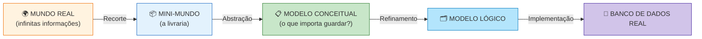
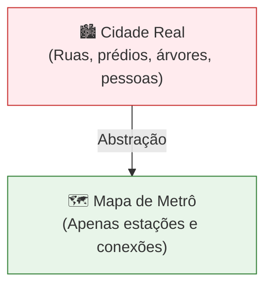
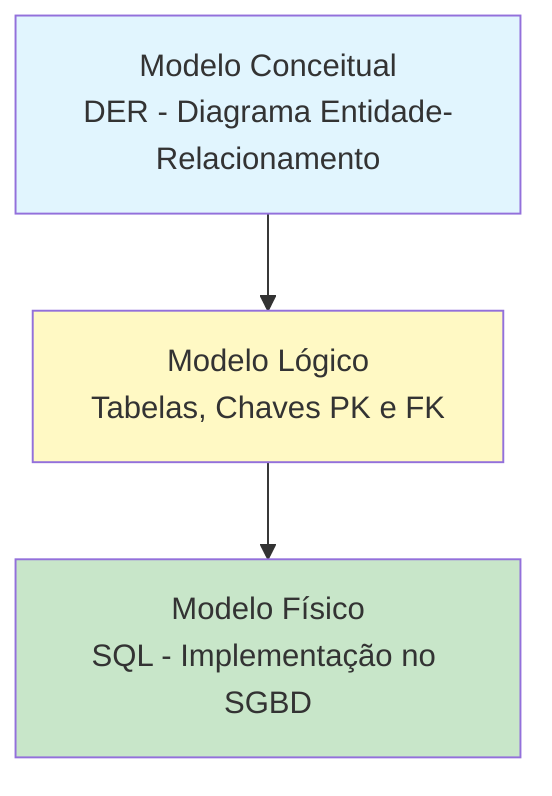
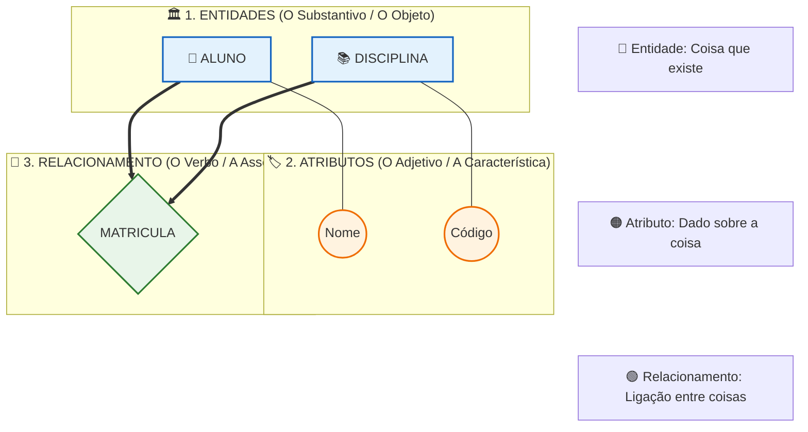
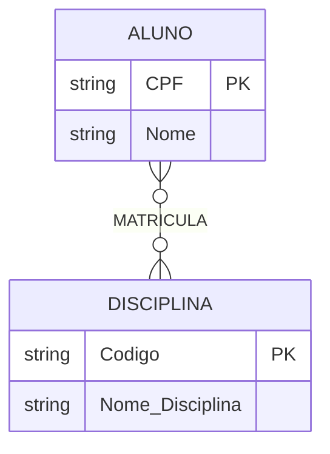
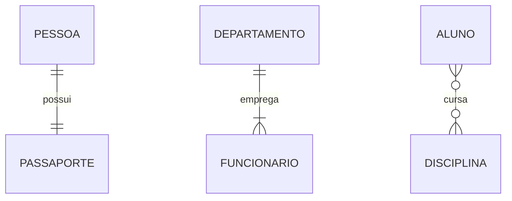

## 2. CONCEITOS FUNDAMENTAIS

### 2.1 MINI-MUNDO

O **mini-mundo** é um recorte da realidade que queremos representar no sistema. Não precisamos modelar o mundo todo, apenas o que interessa ao negócio.

**Exemplo:** Em um sistema escolar, nosso mini-mundo inclui alunos, professores, disciplinas e notas. Não inclui o clima, o preço do pão na padaria ou o trânsito da cidade.

---

### 2.2 ABSTRAÇÃO

**Abstração** é o processo de ignorar detalhes irrelevantes e focar nas características essenciais dos objetos.

> 💡 **Pense assim:** Um mapa de metrô não mostra cada árvore ou prédio da cidade. Ele abstrai a realidade para mostrar apenas estações e linhas. O modelo de dados faz o mesmo!

---

### 2.3 OS TRÊS NÍVEIS DE MODELAGEM

| Nível                       | Pergunta que responde                 | Quem entende            | Linguagem               |
| --------------------------- | ------------------------------------- | ----------------------- | ----------------------- |
| **Conceitual** (alto nível) | *"O QUE o sistema guarda?"*           | Cliente, analista, você | Diagramas, português    |
| **Lógico** (intermediário)  | *"COMO os dados estão estruturados?"* | Analista, desenvolvedor | Tabelas, chaves, regras |
| **Físico** (baixo nível)    | *"COMO fica no computador?"*          | SGBD, DBA               | **SQL**                 |

**Fluxo:** Conceitual (o QUÊ) → Lógico (o COMO) → Físico (a IMPLEMENTAÇÃO)

> 📌 O **modelo conceitual** é de alto nível — próximo da linguagem humana. O **modelo físico** é de baixo nível — próximo da linguagem da máquina, escrito em **SQL**. Entre eles, quem gerencia tudo é o **SGBD** (Sistema Gerenciador de Banco de Dados), como MySQL, PostgreSQL e Oracle.

---

### 2.4 MER E DER — QUAL A DIFERENÇA?

| Sigla   | Nome                             | O que é                                                    |
| ------- | -------------------------------- | ---------------------------------------------------------- |
| **MER** | Modelo Entidade-Relacionamento   | O **modelo** — conjunto de conceitos e regras              |
| **DER** | Diagrama Entidade-Relacionamento | O **desenho** — representação gráfica do MER  |

> 🎓 **Analogia**: MER é o "projeto" e DER é o "desenho do projeto no papel". Na prática usamos os termos de forma próxima, mas em prova essa diferença cai!

---

### 2.5 OS PILARES DO MER: ENTIDADE, ATRIBUTO E RELACIONAMENTO

Para construir o MER, precisamos entender seus três componentes fundamentais. Pense neles como as partes de uma frase: **Substantivo, Adjetivo e Verbo**.

Abaixo, veja a "anatomia" de um modelo conceitual simples. Observe como cada peça tem uma cor e uma função específica, mas todas dependem umas das outras para fazer sentido:

**Entendendo a Anatomia:**
1. **Entidade (Azul):** É o objeto principal (Ex: `ALUNO`). É sobre ela que guardamos dados.
2. **Atributo (Laranja):** É uma característica da entidade (Ex: `Nome` do aluno). *Note que ele está fisicamente ligado à entidade, pois não existe "Nome" sem saber de quem é.*
3. **Relacionamento (Verde):** É a ponte que conecta duas entidades (Ex: O aluno `MATRICULA` a disciplina).

---

### 2.6 CHAVES E CARDINALIDADE (O CORAÇÃO DO MER)

Saber quem são as entidades não basta. Precisamos definir **como elas se identificam** e **como elas se conectam**.

#### 1. CHAVE PRIMÁRIA (PK - PRIMARY KEY)

É o atributo (ou conjunto de atributos) que identifica uma instância da entidade de forma **única e inequívoca**. 
* **Exemplo:** O `CPF` no Cliente ou o `ID_LIVRO` no Livro. 
* **No diagrama:** Na notação Chen, sublinhamos o atributo. No Mermaid (Pé de Galinha), basta adicionar a tag `PK` ao lado do atributo, e ele será sublinhado automaticamente.

Veja como isso fica na prática, observando as entidades, seus atributos e a chave primária destacada:

#### 2. CARDINALIDADE

Define a **quantidade mínima e máxima** de ocorrências de uma entidade que podem (ou devem) se associar a uma ocorrência da outra entidade. É a regra de negócio pura!

* **1:1 (Um para Um):** Uma instância de A se associa a no máximo uma de B, e vice-versa.
* **1:N (Um para Muitos):** Uma instância de A se associa a muitas de B, mas uma de B se associa a no máximo uma de A. *(O mais comum!)*
* **N:M (Muitos para Muitos):** Uma instância de A se associa a muitas de B, e vice-versa.

Observe os três tipos de cardinalidade lado a lado:

#### 📊 DECODIFICADOR DE CARDINALIDADE (PÉ DE GALINHA)

Para ler os diagramas acima, use esta tabela como guia. Os símbolos nas pontas das linhas ditam a regra:

| Símbolo na Ponta | Nome Visual | Significado na Regra de Negócio | Exemplo Prático no Diagrama |
| :---: | :--- | :--- | :--- |
| `||` | **Uma e apenas uma** | Obrigatório e único. | Uma `PESSOA` possui **uma e apenas uma** `PASSAPORTE`. |
| `|{` ou `}|` | **Um ou muitos** | Obrigatório, mas pode se repetir. | Um `DEPARTAMENTO` emprega **um ou muitos** `FUNCIONARIO`. |
| `}o` ou `o{` | **Zero ou muitos** | Opcional e pode se repetir. | Um `ALUNO` cursa **zero ou muitas** `DISCIPLINA`. |

> 💡 **Dica de Ouro para Leitura:** Sempre leia o diagrama **da esquerda para a direita** e depois **da direita para a esquerda**. 
> *Exemplo (linha de baixo):* "Um **ALUNO** (`}o`) pode cursar **zero ou muitas** **DISCIPLINAS**. E uma **DISCIPLINA** (`o{`) pode ter **zero ou muitos** **ALUNOS**."

---

### 2.7 NOTAÇÕES DE DIAGRAMAS ER 🎨

O mesmo modelo pode ser **desenhado** de formas diferentes — o que muda é a **notação**, nunca os conceitos:

| Notação                         | Entidade               | Relacionamento  | Cardinalidade                | Onde é usada                            |
| ------------------------------- | ---------------------- | --------------- | ---------------------------- | --------------------------------------- |
| **Chen**                        | Retângulo ▢            | Losango ◊       | Números nas linhas (1, N)    | Academia, concursos, BrModelo           |
| **Pé de Galinha (Crow's Foot)** | Retângulo              | Sem losango     | Símbolos nas pontas (‖, o{)  | Mercado de trabalho, Mermaid, Workbench |
| **UML (diagrama de classes)**   | Retângulo com divisões | Linha com setas | Multiplicidades (1..*, 0..*) | Desenvolvimento de software OO          |

**Os símbolos da notação de Chen que usaremos:**

| Símbolo | Nome               | Função                                                           |
| :-----: | ------------------ | ---------------------------------------------------------------- |
|    ▢    | Retângulo          | Entidade                                                         |
|    ◊    | Losango            | Relacionamento                                                   |
|    ↝    | Linhas             | Ligam entidades aos relacionamentos                              |
|   𐤏    | Oval               | Atributo                                                         |
|    △    | Triângulo          | Atributo multivalorado **ou** generalização (ver Unidades 3 e 8) |
|    ●    | Círculo preenchido | Chave primária                                                   |

> 💡 **Dica do Professor**: nesta apostila usamos as duas principais! Os diagramas de fluxo seguem a lógica de **Chen** (boa para provas) e os `erDiagram` do Mermaid seguem o **Pé de Galinha** (boa para o mercado). Os conceitos são os mesmos — aprenda a "traduzir" entre elas!
