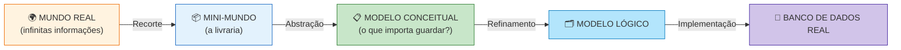
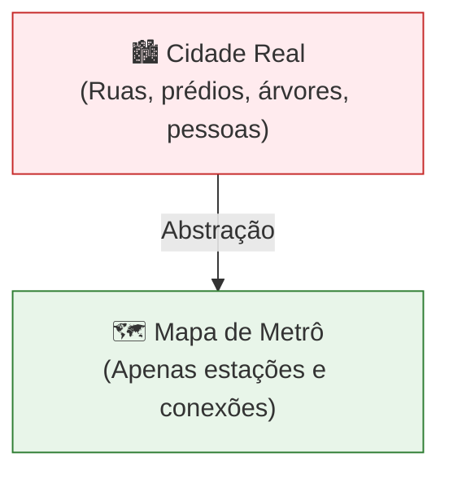
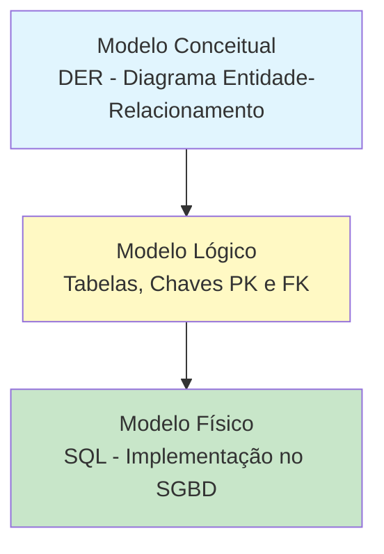
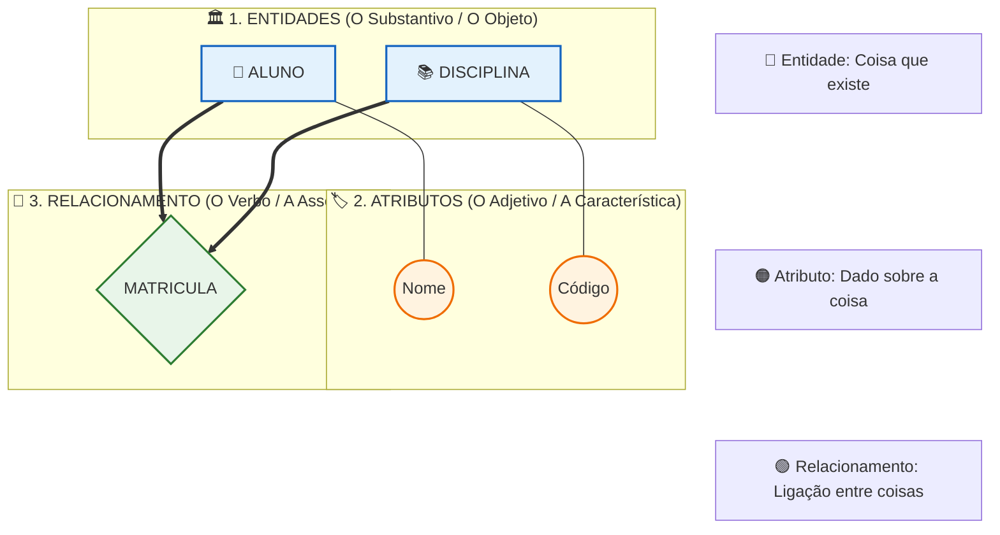
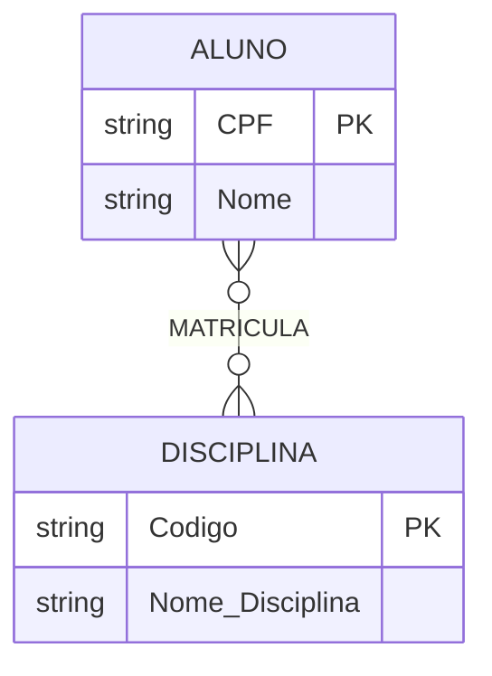

## 2. CONCEITOS FUNDAMENTAIS

### 2.1 Mini-Mundo

O **mini-mundo** é um recorte da realidade que queremos representar no sistema. Não precisamos modelar o mundo todo, apenas o que interessa ao negócio.

**Exemplo:** Em um sistema escolar, nosso mini-mundo inclui alunos, professores, disciplinas e notas. Não inclui o clima, o preço do pão na padaria ou o trânsito da cidade.

---

### 2.2 Abstração

**Abstração** é o processo de ignorar detalhes irrelevantes e focar nas características essenciais dos objetos.

> 💡 **Pense assim:** Um mapa de metrô não mostra cada árvore ou prédio da cidade. Ele abstrai a realidade para mostrar apenas estações e linhas. O modelo de dados faz o mesmo!

---

### 2.3 Os Três Níveis de Modelagem

| Nível                       | Pergunta que responde                 | Quem entende            | Linguagem               |
| --------------------------- | ------------------------------------- | ----------------------- | ----------------------- |
| **Conceitual** (alto nível) | *"O QUE o sistema guarda?"*           | Cliente, analista, você | Diagramas, português    |
| **Lógico** (intermediário)  | *"COMO os dados estão estruturados?"* | Analista, desenvolvedor | Tabelas, chaves, regras |
| **Físico** (baixo nível)    | *"COMO fica no computador?"*          | SGBD, DBA               | **SQL**                 |

**Fluxo:** Conceitual (o QUÊ) → Lógico (o COMO) → Físico (a IMPLEMENTAÇÃO)

> 📌 O **modelo conceitual** é de alto nível — próximo da linguagem humana. O **modelo físico** é de baixo nível — próximo da linguagem da máquina, escrito em **SQL**. Entre eles, quem gerencia tudo é o **SGBD** (Sistema Gerenciador de Banco de Dados), como MySQL, PostgreSQL e Oracle.

---

### 2.4 MER e DER — QUAL A DIFERENÇA?

| Sigla   | Nome                             | O que é                                                    |
| ------- | -------------------------------- | ---------------------------------------------------------- |
| **MER** | Modelo Entidade-Relacionamento   | O **modelo** — conjunto de conceitos e regras              |
| **DER** | Diagrama Entidade-Relacionamento | O **desenho** — representação gráfica do MER  |

> 🎓 **Analogia**: MER é o "projeto" e DER é o "desenho do projeto no papel". Na prática usamos os termos de forma próxima, mas em prova essa diferença cai!

---

### 2.5 OS PILARES DO MER: ENTIDADE, ATRIBUTO E RELACIONAMENTO

Para construir o MER, precisamos entender seus três componentes fundamentais. Pense neles como as partes de uma frase: **Substantivo, Adjetivo e Verbo**.

Abaixo, veja a "anatomia" de um modelo conceitual simples. Observe como cada peça tem uma cor e uma função específica, mas todas dependem umas das outras para fazer sentido:

**Entendendo a Anatomia:**
1. **Entidade (Azul):** É o objeto principal (Ex: `ALUNO`). É sobre ela que guardamos dados.
2. **Atributo (Laranja):** É uma característica da entidade (Ex: `Nome` do aluno). *Note que ele está fisicamente ligado à entidade, pois não existe "Nome" sem saber de quem é.*
3. **Relacionamento (Verde):** É a ponte que conecta duas entidades (Ex: O aluno `MATRICULA` a disciplina).

---

### 2.6 DO CONCEITO À PRÁTICA: CHAVES E CARDINALIDADE

Saber desenhar os pilares é o primeiro passo. Agora, precisamos dar **regras** a esse desenho. É aqui que o modelo ganha inteligência.

#### 1. Chave Primária (PK)
É o atributo que identifica uma instância da entidade de forma **única**. No diagrama abaixo, o `CPF` e o `Codigo` são marcados como `PK` (Primary Key), o que automaticamente os sublinha no gráfico.

#### 2. Cardinalidade (A Regra de Negócio)
Define a **quantidade** de ligações permitidas entre as entidades. É a resposta para: *"Um aluno pode cursar quantas disciplinas?"*

Veja como essa mesma "anatomia" é traduzida para a notação **Pé de Galinha (Crow's Foot)**, que é o padrão absoluto do mercado de trabalho e de ferramentas como MySQL Workbench e Mermaid:

> 💡 **Como ler o diagrama acima:** 
> * **Entidades e Atributos:** As caixas `ALUNO` e `DISCIPLINA` contêm seus atributos. O `PK` ao lado de `CPF` e `Codigo` indica que são as Chaves Primárias.
> * **A Linha de Relacionamento (`}o--o{`):** 
>   * O lado do `ALUNO` tem `}o` (zero ou muitos).
>   * O lado da `DISCIPLINA` tem `o{` (zero ou muitos).
>   * **Tradução da Regra:** "Um **ALUNO** pode se matricular em **zero ou muitas** **DISCIPLINAS**. E uma **DISCIPLINA** pode ter **zero ou muitos** **ALUNOS** matriculados." (Um clássico relacionamento N:M / Muitos para Muitos).

---

### 2.7 NOTAÇÕES DE DIAGRAMAS ER 🎨

O mesmo modelo pode ser **desenhado** de formas diferentes — o que muda é a **notação**, nunca os conceitos:

| Notação                         | Entidade               | Relacionamento  | Cardinalidade                | Onde é usada                            |
| ------------------------------- | ---------------------- | --------------- | ---------------------------- | --------------------------------------- |
| **Chen**                        | Retângulo ▢            | Losango ◊       | Números nas linhas (1, N)    | Academia, concursos, BrModelo           |
| **Pé de Galinha (Crow's Foot)** | Retângulo              | Sem losango     | Símbolos nas pontas (‖, o{)  | Mercado de trabalho, Mermaid, Workbench |
| **UML (diagrama de classes)**   | Retângulo com divisões | Linha com setas | Multiplicidades (1..*, 0..*) | Desenvolvimento de software OO          |

**Os símbolos da notação de Chen que usaremos:**

| Símbolo | Nome               | Função                                                           |
| :-----: | ------------------ | ---------------------------------------------------------------- |
|    ▢    | Retângulo          | Entidade                                                         |
|    ◊    | Losango            | Relacionamento                                                   |
|    ↝    | Linhas             | Ligam entidades aos relacionamentos                              |
|   𐤏    | Oval               | Atributo                                                         |
|    △    | Triângulo          | Atributo multivalorado **ou** generalização (ver Unidades 3 e 8) |
|    ●    | Círculo preenchido | Chave primária                                                   |

> 💡 **Dica do Professor**: nesta apostila usamos as duas principais! Os diagramas de fluxo seguem a lógica de **Chen** (boa para provas) e os `erDiagram` do Mermaid seguem o **Pé de Galinha** (boa para o mercado). Os conceitos são os mesmos — aprenda a "traduzir" entre elas!
