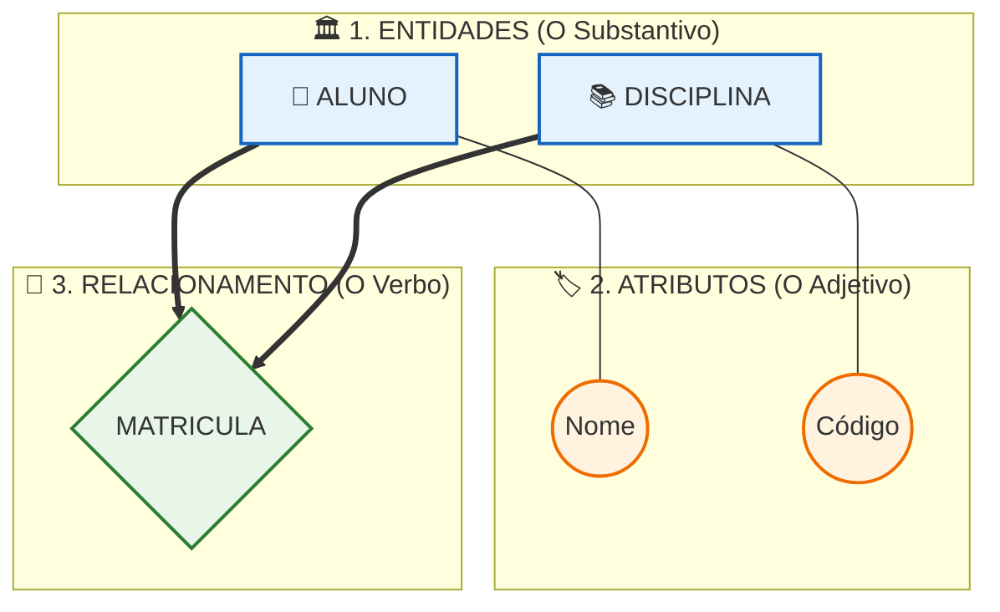

## 📚 CONCEITOS BÁSICOS DE MER PARA CRIAÇÃO DE MODELAGEM DE DADOS

### 🌍 INTRODUÇÃO

A criação de um banco de dados eficiente não começa pela digitação de comandos no computador, mas sim pelo planejamento cuidadoso das informações que serão armazenadas. Imagine tentar construir uma casa sem uma planta baixa: o resultado seria caos, retrabalho e falhas estruturais. No desenvolvimento de software, a modelagem de dados cumpre exatamente o papel dessa planta baixa.

O ponto de partida é o conceito de **mini-mundo**: um recorte intencional da realidade, contendo apenas os fatos e objetos relevantes para o negócio. Em um sistema escolar, o mini-mundo abrange alunos e disciplinas, ignorando informações irrelevantes como o clima.

Para transformar essa realidade em um modelo compreensível, utilizamos a **abstração**. Abstrair significa ignorar detalhes supérfluos e focar nas características essenciais. Assim como um mapa de metrô mostra apenas estações e conexões, o modelo de dados simplifica a realidade para torná-la gerenciável.

> 💡 **Dica:** O mini-mundo é o "recorte" e a abstração é o "filtro" que aplicamos sobre esse recorte.

---

### 🏗️ DESENVOLVIMENTO

#### Os Três Níveis de Modelagem
A modelagem é dividida em três níveis que guiam o projeto do conceito à implementação:
1. **Conceitual:** Responde "O que o sistema guarda?". Linguagem humana, diagramas.
2. **Lógico:** Responde "Como os dados estão estruturados?". Tabelas e chaves.
3. **Físico:** Responde "Como os dados ficam no computador?". Código SQL executado pelo SGBD.

#### MER vs. DER: Qual a diferença?
* **MER (Modelo Entidade-Relacionamento):** É o conjunto de conceitos e regras (o projeto).
* **DER (Diagrama Entidade-Relacionamento):** É a representação gráfica visual desse modelo (o desenho).

#### Os Pilares do MER
O MER é sustentado por três componentes fundamentais. Observe a "anatomia" de um modelo conceitual simples:


* **Entidade:** Objeto ou conceito sobre o qual guardamos dados (Ex: ALUNO).
* **Atributo:** Característica da entidade (Ex: Nome).
* **Relacionamento:** Associação lógica entre entidades (Ex: MATRICULA).

#### Chaves e Cardinalidade
* **Chave Primária (PK):** Atributo que identifica a entidade de forma única (Ex: CPF).
* **Cardinalidade:** Define a quantidade de ligações permitidas (1:1, 1:N ou N:M). É a regra de negócio pura.

> ⚠️ **Ponto de atenção:** Sem definir a cardinalidade corretamente, o sistema pode permitir que um aluno se matricule em uma disciplina inexistente, ou que uma disciplina fique sem nenhum aluno, violando regras do negócio.

Para ilustrar a transição para o modelo físico, veja como o conceito vira código:
```sql
CREATE TABLE Aluno (
    CPF VARCHAR(11) PRIMARY KEY, -- Define o CPF como texto e chave única
    Nome VARCHAR(100) NOT NULL   -- Define o nome como texto obrigatório
);
```
