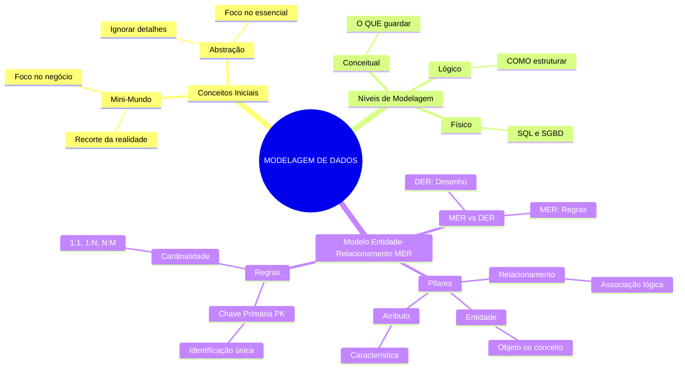

# MAPA MENTAL (MERMAID)

```mermaid
mindmap
  root((MODELAGEM DE DADOS))
    Conceitos Iniciais
      Mini-Mundo
        Recorte da realidade
        Foco no negócio
      Abstração
        Ignorar detalhes
        Foco no essencial
    Níveis de Modelagem
      Conceitual
        O QUE guardar
      Lógico
        COMO estruturar
      Físico
        SQL e SGBD
    Modelo Entidade-Relacionamento MER
      MER vs DER
        MER: Regras
        DER: Desenho
      Pilares
        Entidade
          Objeto ou conceito
        Atributo
          Característica
        Relacionamento
          Associação lógica
      Regras
        Chave Primária PK
          Identificação única
        Cardinalidade
          1:1, 1:N, N:M
```
