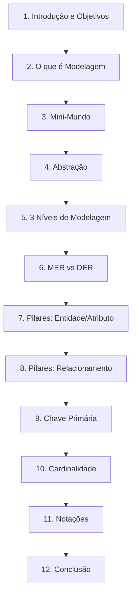

```mermaid
flowchart TD
    A[1. Introdução e Objetivos] --> B[2. O que é Modelagem]
    B --> C[3. Mini-Mundo]
    C --> D[4. Abstração]
    D --> E[5. 3 Níveis de Modelagem]
    E --> F[6. MER vs DER]
    F --> G[7. Pilares: Entidade/Atributo]
    G --> H[8. Pilares: Relacionamento]
    H --> I[9. Chave Primária]
    I --> J[10. Cardinalidade]
    J --> K[11. Notações]
    K --> L[12. Conclusão]
```
