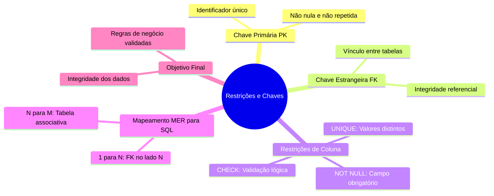

# MAPA MENTAL

```mermaid
mindmap
  root((Restrições e Chaves))
    Chave Primária PK
      Identificador único
      Não nula e não repetida
    Chave Estrangeira FK
      Integridade referencial
      Vínculo entre tabelas
    Restrições de Coluna
      UNIQUE: Valores distintos
      NOT NULL: Campo obrigatório
      CHECK: Validação lógica
    Mapeamento MER para SQL
      1 para N: FK no lado N
      N para M: Tabela associativa
    Objetivo Final
      Integridade dos dados
      Regras de negócio validadas
```

