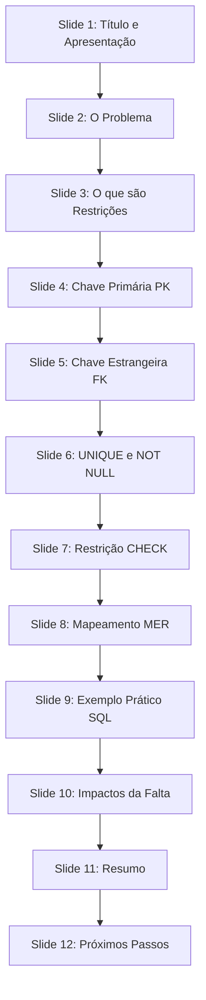

# Sequência Lógica

```mermaid
flowchart TD
    A[Slide 1: Título e Apresentação] --> B[Slide 2: O Problema]
    B --> C[Slide 3: O que são Restrições]
    C --> D[Slide 4: Chave Primária PK]
    D --> E[Slide 5: Chave Estrangeira FK]
    E --> F[Slide 6: UNIQUE e NOT NULL]
    F --> G[Slide 7: Restrição CHECK]
    G --> H[Slide 8: Mapeamento MER]
    H --> I[Slide 9: Exemplo Prático SQL]
    I --> J[Slide 10: Impactos da Falta]
    J --> K[Slide 11: Resumo]
    K --> L[Slide 12: Próximos Passos]
```
