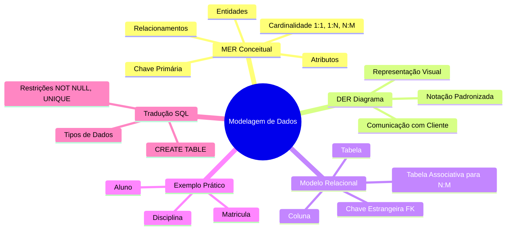

# MAPA MENTAL

```mermaid
mindmap
  root((Modelagem de Dados))
    MER Conceitual
      Entidades
      Atributos
      Chave Primária
      Relacionamentos
      Cardinalidade 1:1, 1:N, N:M
    DER Diagrama
      Representação Visual
      Notação Padronizada
      Comunicação com Cliente
    Modelo Relacional
      Tabela
      Coluna
      Chave Estrangeira FK
      Tabela Associativa para N:M
    Exemplo Prático
      Aluno
      Disciplina
      Matricula
    Tradução SQL
      CREATE TABLE
      Tipos de Dados
      Restrições NOT NULL, UNIQUE
```
