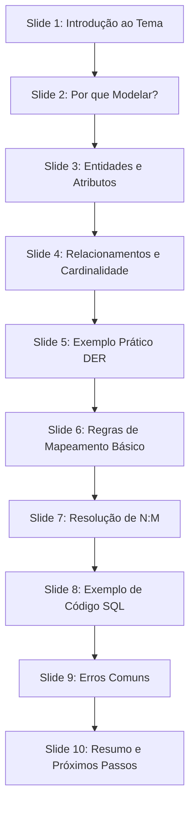

# Sequência Lógica dos Slides

```mermaid
flowchart TD
    A[Slide 1: Introdução ao Tema] --> B[Slide 2: Por que Modelar?]
    B --> C[Slide 3: Entidades e Atributos]
    C --> D[Slide 4: Relacionamentos e Cardinalidade]
    D --> E[Slide 5: Exemplo Prático DER]
    E --> F[Slide 6: Regras de Mapeamento Básico]
    F --> G[Slide 7: Resolução de N:M]
    G --> H[Slide 8: Exemplo de Código SQL]
    H --> I[Slide 9: Erros Comuns]
    I --> J[Slide 10: Resumo e Próximos Passos]
```
