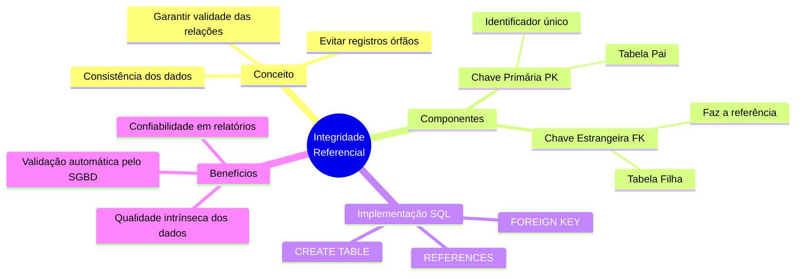

## MAPA MENTAL

```mermaid
mindmap
  root((Integridade<br/>Referencial))
    Conceito
      Garantir validade das relações
      Evitar registros órfãos
      Consistência dos dados
    Componentes
      Chave Primária PK
        Identificador único
        Tabela Pai
      Chave Estrangeira FK
        Faz a referência
        Tabela Filha
    Implementação SQL
      CREATE TABLE
      FOREIGN KEY
      REFERENCES
    Benefícios
      Validação automática pelo SGBD
      Confiabilidade em relatórios
      Qualidade intrínseca dos dados
```
