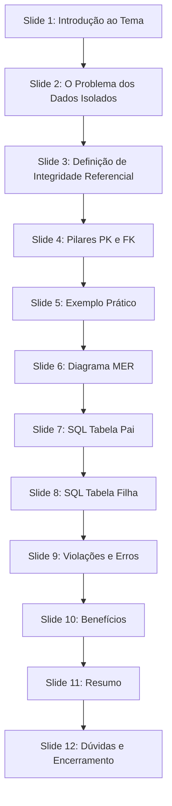

### Fluxograma Lógico dos Slides

```mermaid
flowchart TD
    A[Slide 1: Introdução ao Tema] --> B[Slide 2: O Problema dos Dados Isolados]
    B --> C[Slide 3: Definição de Integridade Referencial]
    C --> D[Slide 4: Pilares PK e FK]
    D --> E[Slide 5: Exemplo Prático]
    E --> F[Slide 6: Diagrama MER]
    F --> G[Slide 7: SQL Tabela Pai]
    G --> H[Slide 8: SQL Tabela Filha]
    H --> I[Slide 9: Violações e Erros]
    I --> J[Slide 10: Benefícios]
    J --> K[Slide 11: Resumo]
    K --> L[Slide 12: Dúvidas e Encerramento]
```
