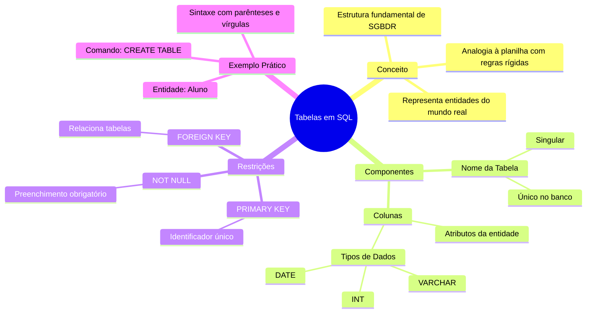

## MAPA MENTAL

```mermaid
mindmap
  root((Tabelas em SQL))
    Conceito
      Estrutura fundamental de SGBDR
      Analogia à planilha com regras rígidas
      Representa entidades do mundo real
    Componentes
      Nome da Tabela
        Singular
        Único no banco
      Colunas
        Atributos da entidade
        Tipos de Dados
          INT
          VARCHAR
          DATE
    Restrições
      PRIMARY KEY
        Identificador único
      NOT NULL
        Preenchimento obrigatório
      FOREIGN KEY
        Relaciona tabelas
    Exemplo Prático
      Entidade: Aluno
      Comando: CREATE TABLE
      Sintaxe com parênteses e vírgulas
```
