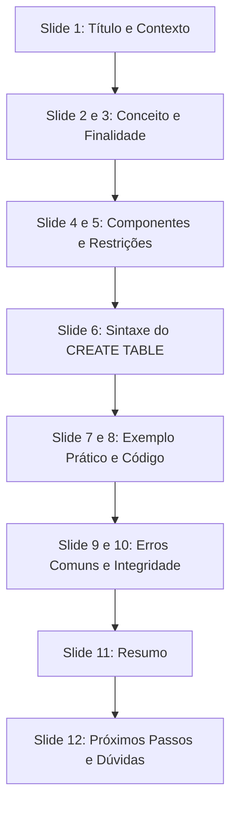

```mermaid
flowchart TD
    A[Slide 1: Título e Contexto] --> B[Slide 2 e 3: Conceito e Finalidade]
    B --> C[Slide 4 e 5: Componentes e Restrições]
    C --> D[Slide 6: Sintaxe do CREATE TABLE]
    D --> E[Slide 7 e 8: Exemplo Prático e Código]
    E --> F[Slide 9 e 10: Erros Comuns e Integridade]
    F --> G[Slide 11: Resumo]
    G --> H[Slide 12: Próximos Passos e Dúvidas]
```
