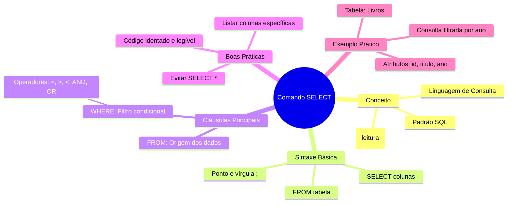

# MAPA MENTAL

```mermaid
mindmap
  root((Comando SELECT))
    Conceito
      Linguagem de Consulta
      Recuperação de dados (leitura)
      Padrão SQL
    Sintaxe Básica
      SELECT colunas
      FROM tabela
      Ponto e vírgula ;
    Cláusulas Principais
      FROM: Origem dos dados
      WHERE: Filtro condicional
        Operadores: =, >, <, AND, OR
    Boas Práticas
      Evitar SELECT *
      Listar colunas específicas
      Código identado e legível
    Exemplo Prático
      Tabela: Livros
      Atributos: id, titulo, ano
      Consulta filtrada por ano
```
