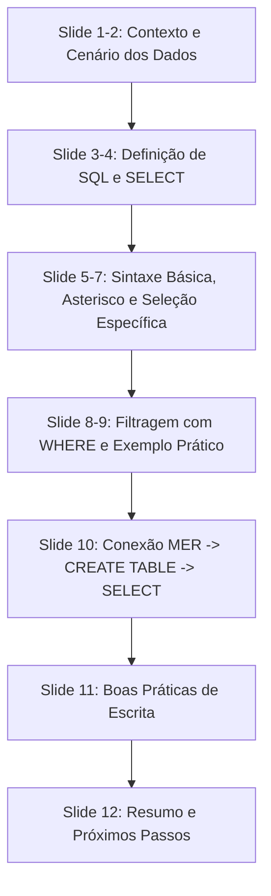

# Fluxograma Lógico dos Slides

```mermaid
flowchart TD
    A[Slide 1-2: Contexto e Cenário dos Dados] --> B[Slide 3-4: Definição de SQL e SELECT]
    B --> C[Slide 5-7: Sintaxe Básica, Asterisco e Seleção Específica]
    C --> D[Slide 8-9: Filtragem com WHERE e Exemplo Prático]
    D --> E[Slide 10: Conexão MER -> CREATE TABLE -> SELECT]
    E --> F[Slide 11: Boas Práticas de Escrita]
    F --> G[Slide 12: Resumo e Próximos Passos]
```
