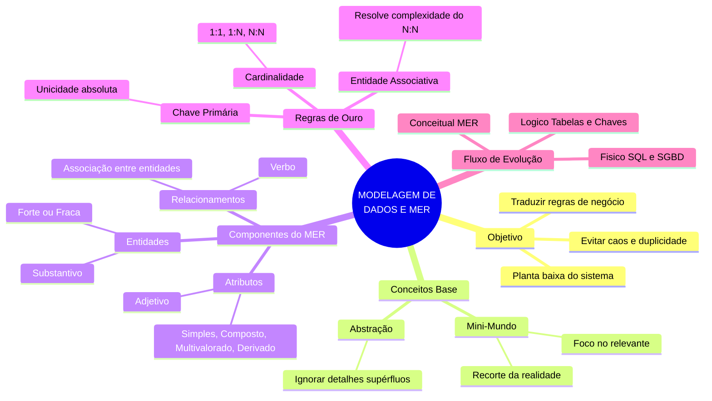

```mermaid
mindmap
  root((MODELAGEM DE
  DADOS E MER))
    Objetivo
      Traduzir regras de negócio
      Evitar caos e duplicidade
      Planta baixa do sistema
    Conceitos Base
      Mini-Mundo
        Recorte da realidade
        Foco no relevante
      Abstração
        Ignorar detalhes supérfluos
    Componentes do MER
      Entidades
        Substantivo
        Forte ou Fraca
      Atributos
        Adjetivo
        Simples, Composto, Multivalorado, Derivado
      Relacionamentos
        Verbo
        Associação entre entidades
    Regras de Ouro
      Chave Primária
        Unicidade absoluta
      Cardinalidade
        1:1, 1:N, N:N
      Entidade Associativa
        Resolve complexidade do N:N
    Fluxo de Evolução
      Conceitual MER
      Logico Tabelas e Chaves
      Fisico SQL e SGBD
```
