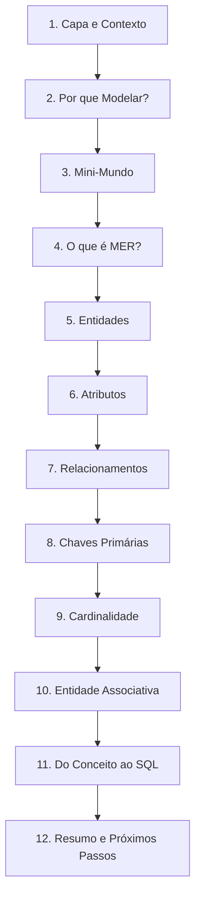

```mermaid
flowchart TD
    A[1. Capa e Contexto] --> B[2. Por que Modelar?]
    B --> C[3. Mini-Mundo]
    C --> D[4. O que é MER?]
    D --> E[5. Entidades]
    E --> F[6. Atributos]
    F --> G[7. Relacionamentos]
    G --> H[8. Chaves Primárias]
    H --> I[9. Cardinalidade]
    I --> J[10. Entidade Associativa]
    J --> K[11. Do Conceito ao SQL]
    K --> L[12. Resumo e Próximos Passos]
```
