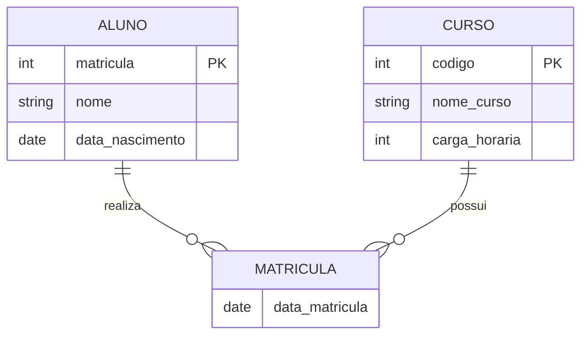

# Diagrama MER do Exemplo Escolar

```mermaid
erDiagram
    ALUNO {
        int matricula PK
        string nome
        date data_nascimento
    }
    CURSO {
        int codigo PK
        string nome_curso
        int carga_horaria
    }
    ALUNO ||--o{ MATRICULA : "realiza"
    CURSO ||--o{ MATRICULA : "possui"
    MATRICULA {
        date data_matricula
    }
```
