# Slide 1
**Bem-vindos ao Empreendedorismo**
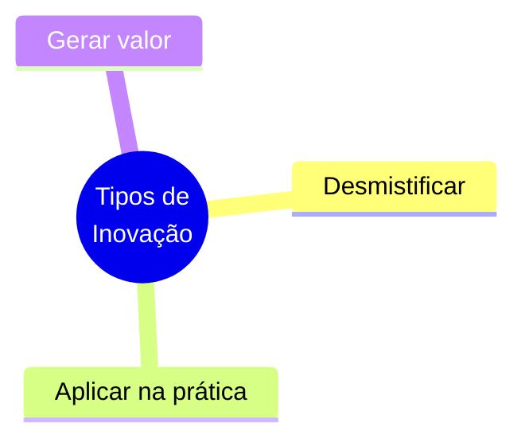
---

# Slide 2
**Invenção vs. Inovação**
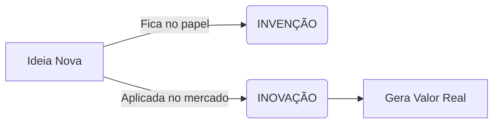
---

# Slide 3
**Por que Inovar?**
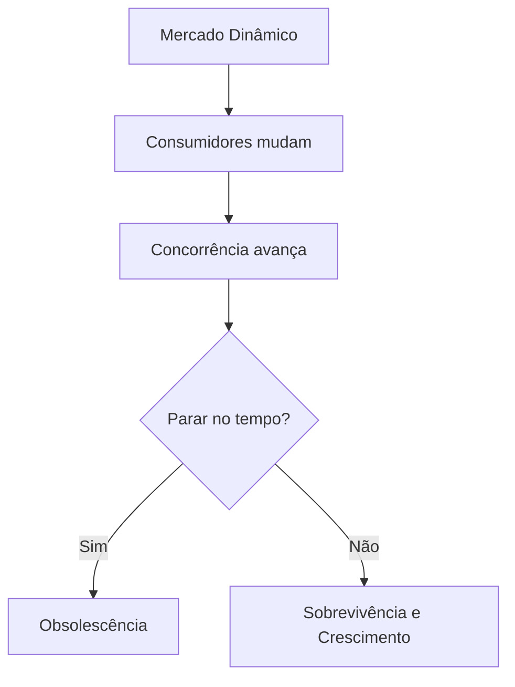

---

# Slide 4
**Os 4 Pilares da Inovação**
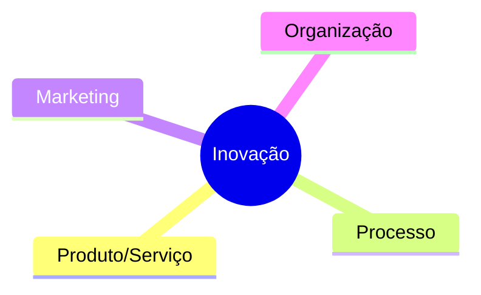

---

# Slide 5
**Inovação em Produto/Serviço**
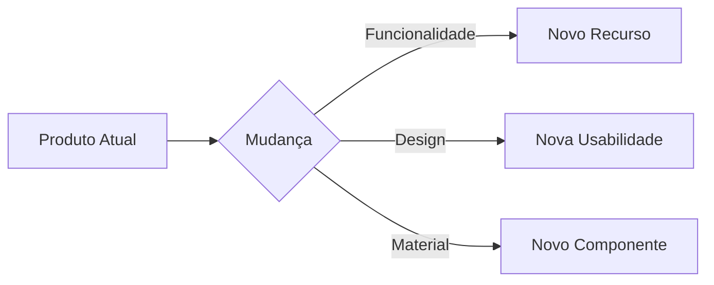

---

# Slide 6
**Inovação em Processo**
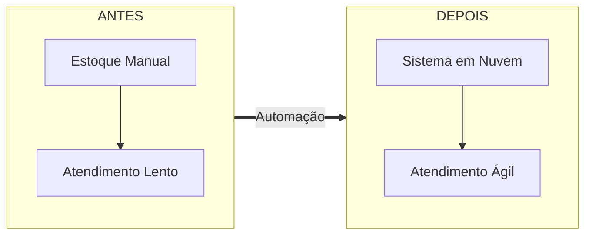

---

# Slide 7
**Inovação em Marketing**
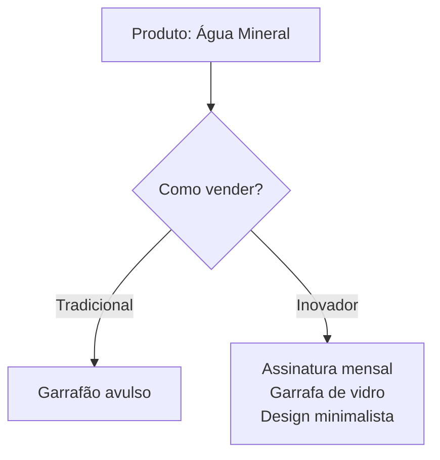

---

# Slide 8
**Inovação Organizacional**
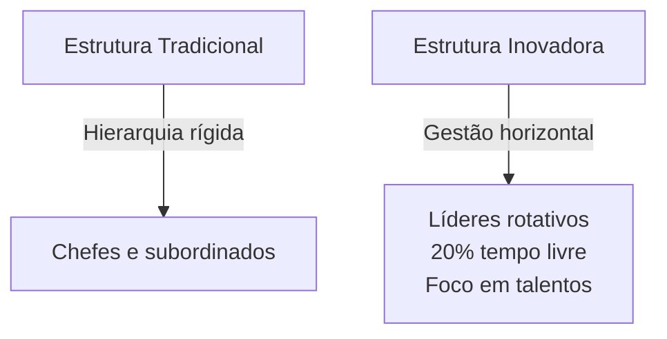

---

# Slide 9
**Grau de Inovação**
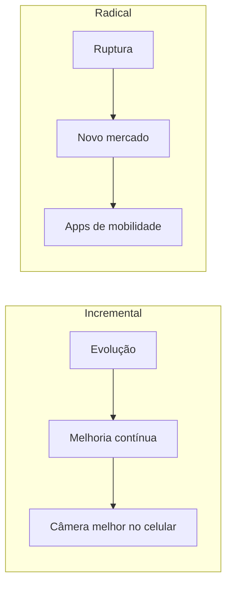

---

# Slide 10
**A Combinação dos Tipos**
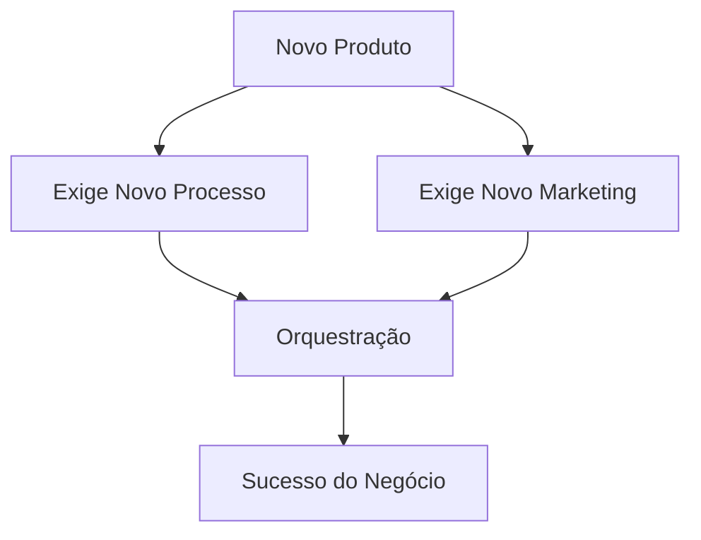

---

# Slide 11
**Conclusão e Próximos Passos**
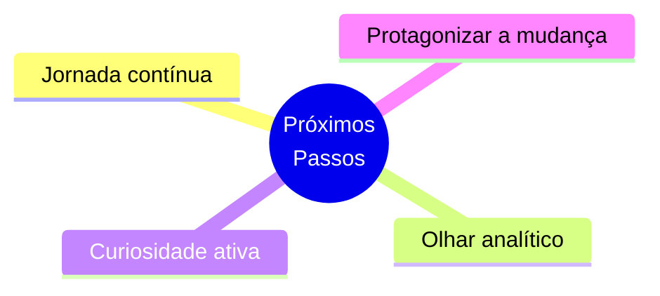
