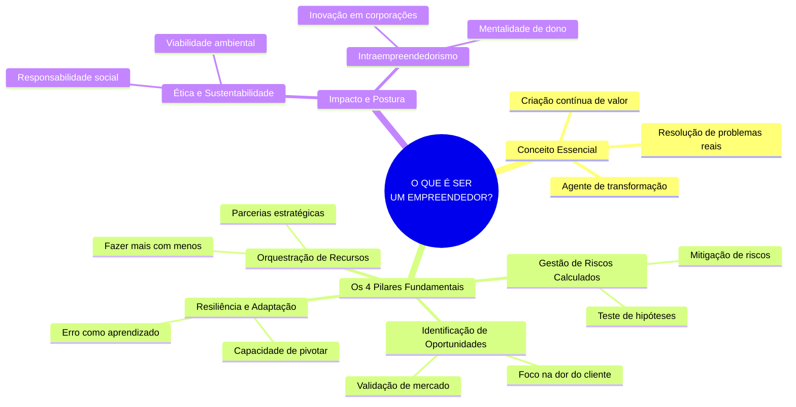

# CONCEITOS FUNDAMENTAIS

```mermaid
mindmap
  root((O QUE É SER<br/>UM EMPREENDEDOR?))
    Conceito Essencial
      Criação contínua de valor
      Resolução de problemas reais
      Agente de transformação
    Os 4 Pilares Fundamentais
      Identificação de Oportunidades
        Foco na dor do cliente
        Validação de mercado
      Gestão de Riscos Calculados
        Mitigação de riscos
        Teste de hipóteses
      Orquestração de Recursos
        Fazer mais com menos
        Parcerias estratégicas
      Resiliência e Adaptação
        Capacidade de pivotar
        Erro como aprendizado
    Impacto e Postura
      Ética e Sustentabilidade
        Responsabilidade social
        Viabilidade ambiental
      Intraempreendedorismo
        Mentalidade de dono
        Inovação em corporações
```
