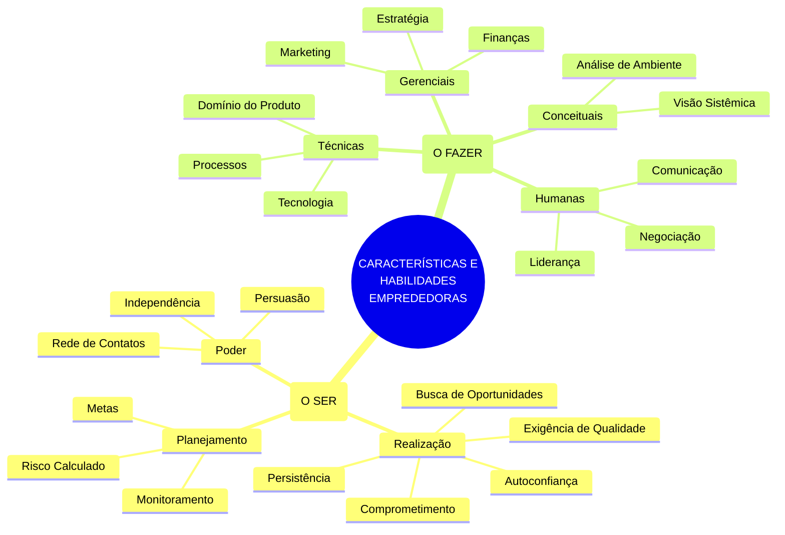

# CARACTERÍSTICAS E HABILIDADES EMPREENDEDORAS

```mermaid
mindmap
  root((CARACTERÍSTICAS E<br/>HABILIDADES<br/>EMPREDEDORAS))
    Comportamentais<br/>(O SER)
      Realização
        Comprometimento
        Persistência
        Busca de Oportunidades
        Exigência de Qualidade
        Autoconfiança
      Planejamento
        Monitoramento
        Metas
        Risco Calculado
      Poder
        Persuasão
        Rede de Contatos
        Independência
    Habilidades<br/>(O FAZER)
      Técnicas
        Domínio do Produto
        Processos
        Tecnologia
      Gerenciais
        Finanças
        Marketing
        Estratégia
      Humanas
        Liderança
        Comunicação
        Negociação
      Conceituais
        Visão Sistêmica
        Análise de Ambiente
```
