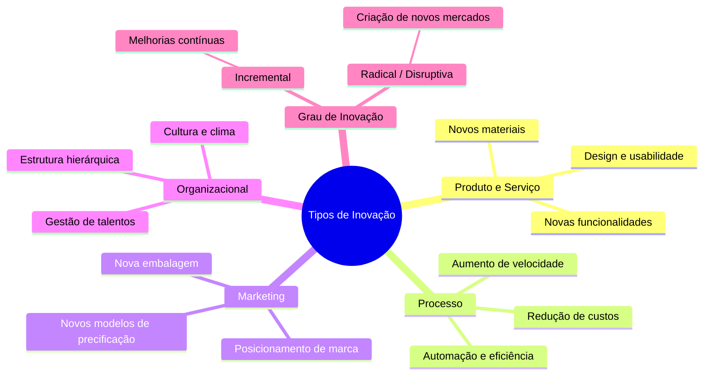

# MAPA MENTAL

```mermaid
mindmap
  root((Tipos de Inovação))
    Produto e Serviço
      Novas funcionalidades
      Design e usabilidade
      Novos materiais
    Processo
      Redução de custos
      Aumento de velocidade
      Automação e eficiência
    Marketing
      Nova embalagem
      Posicionamento de marca
      Novos modelos de precificação
    Organizacional
      Cultura e clima
      Estrutura hierárquica
      Gestão de talentos
    Grau de Inovação
      Incremental
        Melhorias contínuas
      Radical / Disruptiva
        Criação de novos mercados
```
