**Slide 1: Bem-vindos à Empreendedorismo**
- **Visual (Mermaid):**
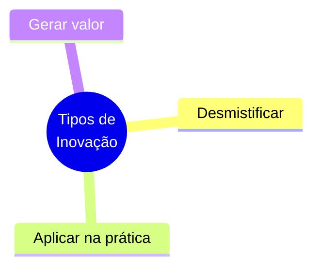
- **Notas do Orador:** Olá, turma! Sejam bem-vindos. Hoje vamos falar sobre inovação. Esqueçam a ideia de que inovar é só para grandes empresas de tecnologia com laboratórios caros. Vamos entender como a inovação é a espinha dorsal de qualquer negócio de sucesso, independentemente do tamanho.

---

**Slide 2: Invenção vs. Inovação**
- **Visual (Mermaid):**
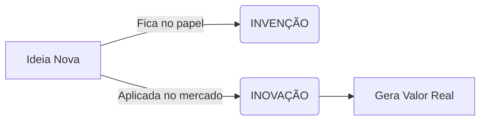
- **Notas do Orador:** Muita gente confunde os dois. Invenção é criar algo do zero, pode ficar só no papel. Inovação é pegar essa invenção, colocar no mercado e gerar valor real para as pessoas. Inovar é resolver problemas de forma mais eficiente.

---

**Slide 3: Por que Inovar?**
- **Visual (Mermaid):**
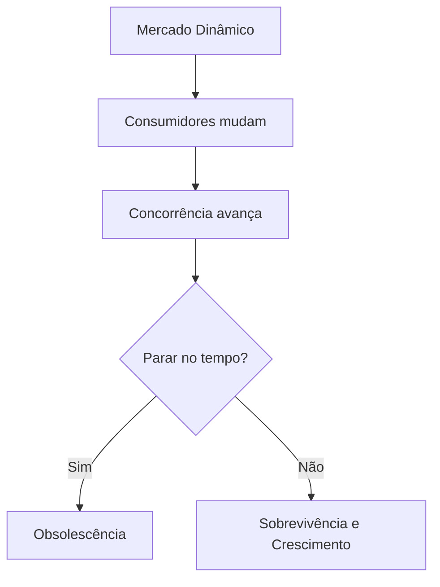
- **Notas do Orador:** Se a empresa para no tempo, ela morre. O mercado muda rápido. Inovar não é um evento de um dia só, é uma atitude contínua de adaptação para garantir que o seu negócio sobreviva e cresça.

---

**Slide 4: Os 4 Pilares da Inovação**
- **Visual (Mermaid):**
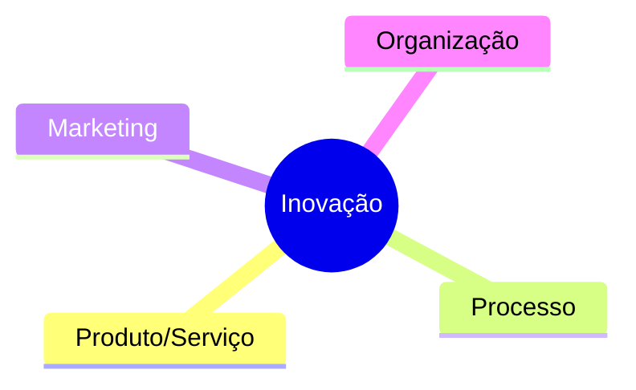
- **Notas do Orador:** A teoria consolida a inovação em 4 grandes frentes. Não inovamos apenas no que vendemos. Podemos inovar em como fazemos, como vendemos e como nos organizamos. Vamos detalhar cada um.

---

**Slide 5: Inovação em Produto/Serviço**
- **Visual (Mermaid):**
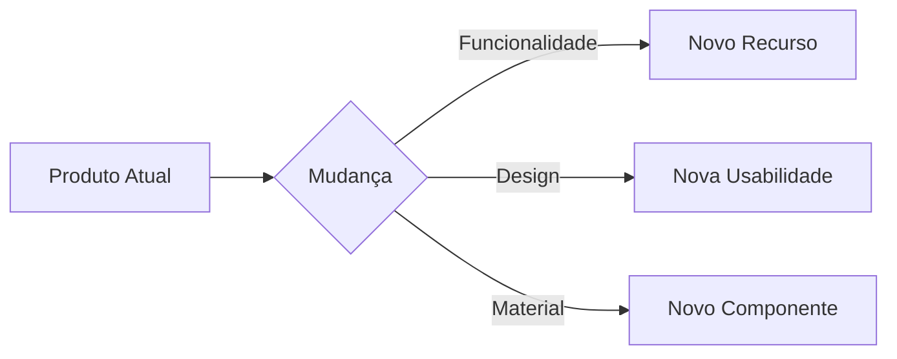
- **Notas do Orador:** É a mais visível. É o que o cliente toca ou usa. Pode ser um produto totalmente novo ou uma melhoria no que já existe, como uma padaria que passa a vender opções sem glúten para atender um novo público.

---

**Slide 6: Inovação em Processo**
- **Visual (Mermaid):**
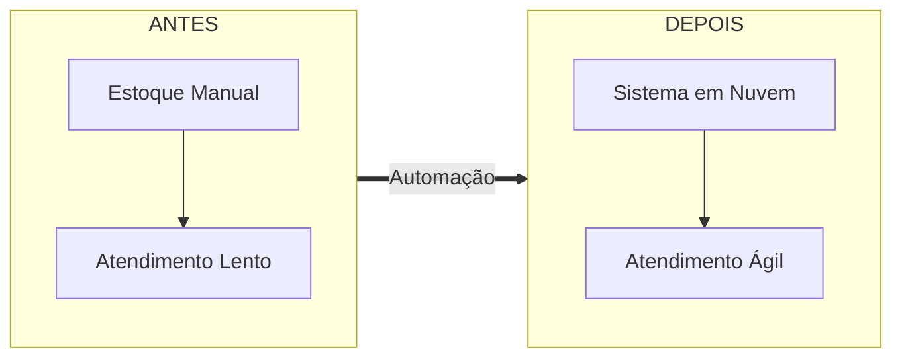
- **Notas do Orador:** Aqui é o "backstage". O cliente não vê, mas sente o resultado. É mudar a forma como produzimos para sermos mais rápidos, baratos ou com mais qualidade. Como o sistema de estoque que agiliza o atendimento.

---

**Slide 7: Inovação em Marketing**
- **Visual (Mermaid):**
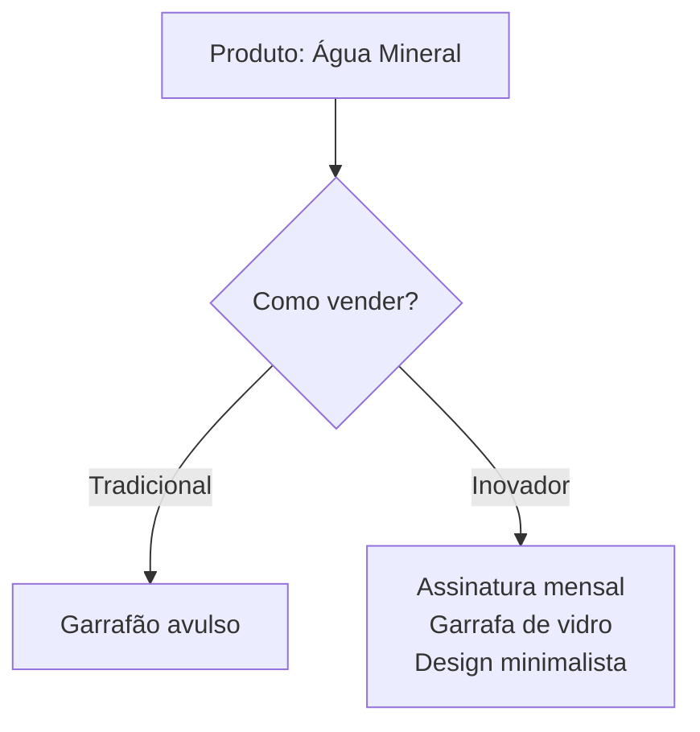
- **Notas do Orador:** É como você empacota e comunica seu valor. O produto pode ser o mesmo, mas a forma de vender muda. Como a água mineral que vira um clube de assinatura com garrafas retornáveis de design moderno.

---

**Slide 8: Inovação Organizacional**
- **Visual (Mermaid):**
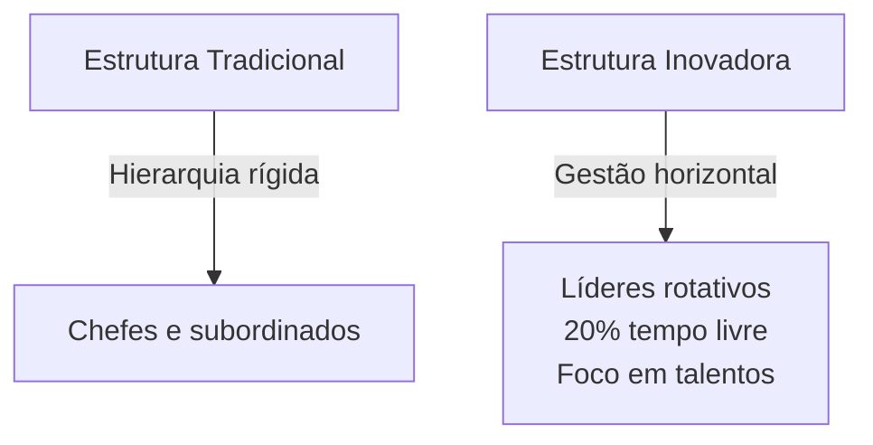
- **Notas do Orador:** A mais difícil, pois mexe com pessoas. É mudar a estrutura da empresa. Exemplo: acabar com a hierarquia rígida e dar tempo para os funcionários criarem seus próprios projetos. Isso retém talentos.

---

**Slide 9: Grau de Inovação**
- **Visual (Mermaid):**
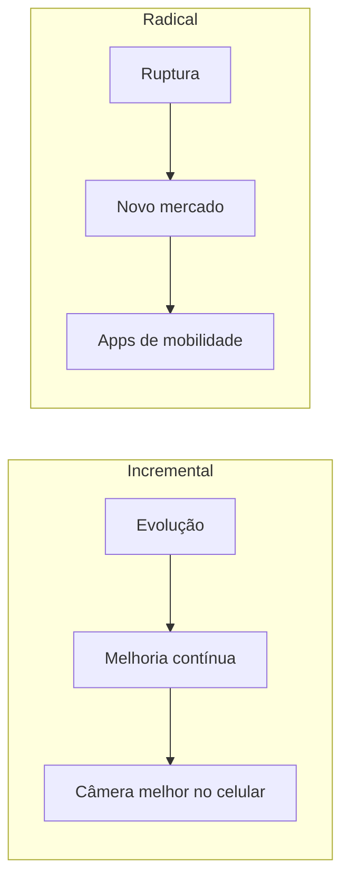
- **Notas do Orador:** Além do "onde", temos o "quanto" se inova. Incremental é evoluir o que já existe. Radical é mudar o jogo completamente, criando um mercado que nem existia antes.

---

**Slide 10: A Combinação dos Tipos**
- **Visual (Mermaid):**
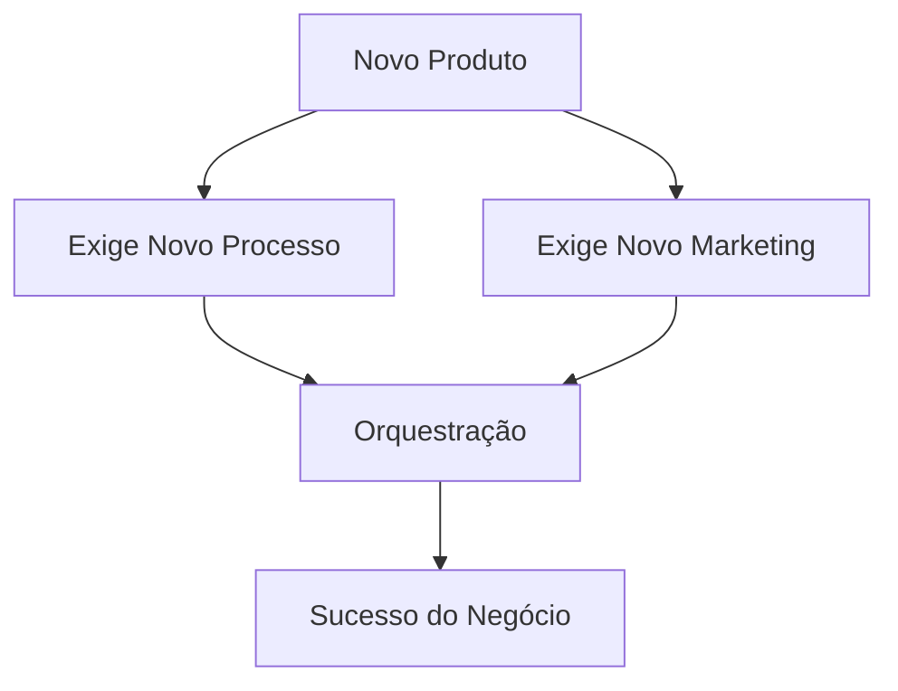
- **Notas do Orador:** Na prática, as coisas se misturam. Se você lança um produto novo, vai precisar de um processo novo para fabricá-lo e um marketing novo para vendê-lo. O segredo é orquestrar tudo isso.

---

**Slide 11: Conclusão e Próximos Passos**
- **Visual (Mermaid):**
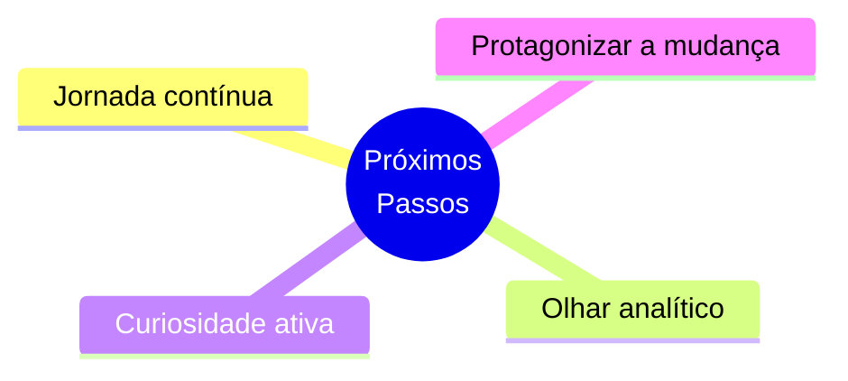
- **Notas do Orador:** Para encerrar: não esperem a ideia genial. Comecem a inovar nos processos e no marketing. Da próxima vez que forem a uma loja, analisem: o que há de novo aqui? Exercitem esse olhar. O futuro pertence a quem protagoniza a mudança. Obrigado!
