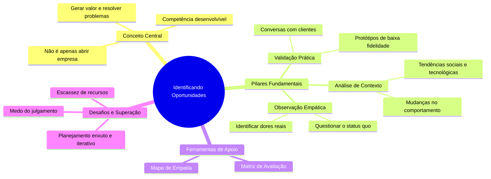

# MAPA MENTAL

```mermaid
mindmap
  root((Identificando Oportunidades))
    Conceito Central
      Não é apenas abrir empresa
      Gerar valor e resolver problemas
      Competência desenvolvível
    Pilares Fundamentais
      Observação Empática
        Identificar dores reais
        Questionar o status quo
      Análise de Contexto
        Tendências sociais e tecnológicas
        Mudanças no comportamento
      Validação Prática
        Conversas com clientes
        Protótipos de baixa fidelidade
    Ferramentas de Apoio
      Matriz de Avaliação
      Mapa de Empatia
    Desafios e Superação
      Medo do julgamento
      Escassez de recursos
      Planejamento enxuto e iterativo
```
