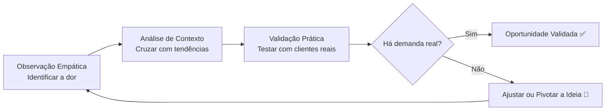

# 🎯 O VERDADEIRO SIGNIFICADO DE EMPREENDER

O empreendedorismo é frequentemente romantizado como um caminho rápido para a riqueza ou apenas o ato burocrático de abrir uma empresa. Na realidade, empreender é a arte de **identificar problemas e criar soluções que gerem valor**. Dentro dessa jornada, a **identificação de oportunidades** é o pilar fundamental e o ponto de partida de qualquer iniciativa de sucesso.

> 💡 **Dica de quem está começando:** Não espere a "ideia do século" aparecer magicamente. Oportunidades estão escondidas em frustrações do dia a dia. Comece observando o que incomoda você ou as pessoas ao seu redor.

Identificar oportunidades não é um dom exclusivo de gênios, mas uma **competência desenvolvível**. Exige um olhar atento para ineficiências, mudanças de comportamento e lacunas no mercado. É crucial distinguir: uma **ideia** é um conceito abstrato; uma **oportunidade** é a interseção entre uma necessidade não satisfeita, a viabilidade de solução e o momento adequado de mercado.

---

## 🛠️ OS 3 PILARES DA IDENTIFICAÇÃO

Para transformar um palpite em uma oportunidade tangível, siga este processo estruturado:

### 1. 🔍 Observação Empática
Saia da sua bolha. Coloque-se no lugar do outro para identificar dores reais. Muitas oportunidades nascem de frustrações simples: falta de tempo, serviços pouco confiáveis ou produtos de baixa qualidade. Atue como um investigador, buscando a causa raiz dos problemas.

### 2. 🌍 Análise de Contexto e Tendências
Oportunidades não existem no vácuo. Elas são moldadas por mudanças sociais, tecnológicas e econômicas. 
> ⚠️ **Erro comum de iniciantes:** Ignorar o macroambiente e criar soluções para problemas que já estão desaparecendo ou que não têm escala devido a barreiras regulatórias.

### 3. ✅ Validação Prática
Uma ideia só vira oportunidade quando há evidência de que alguém pagaria por ela. Valide com conversas diretas, pesquisas de campo ou protótipos de baixa fidelidade (MVP). O objetivo é **aprender**, não vender imediatamente.

### 📦 Exemplo Prático: Conexão Local de Alimentos
- **Cenário:** Bairro com produtores artesanais e edifícios comerciais próximos.
- **Dor identificada:** Trabalhadores sem opções de almoço saudável e rápido; produtores sem canal de venda.
- **Tendência:** Valorização da alimentação natural e economia local.
- **Validação:** Criação de um grupo de mensagens com cardápio semanal hipotético para coletar pedidos antecipados.
- **Resultado:** Confirmação de demanda e parceria logística antes de qualquer investimento em estrutura física.

---

## 🏁 Conclusão: A Jornada Contínua

A identificação de oportunidades exige mudar o foco da **solução** para o **problema e as pessoas**. Ao dominar a observação, análise e validação, você troca a sorte pelo método. 

> ⚠️ **Erro comum de iniciantes:** Apegar-se emocionalmente à primeira ideia e recusar feedbacks negativos, desperdiçando recursos em uma solução que o mercado não quer.

Os desafios (medo, escassez de recursos, resistência do mercado) são superados com **planejamento enxuto**. Encare a identificação de oportunidades como uma prática contínua. O mercado muda, e sua curiosidade e coragem para testar hipóteses serão sua bússola para gerar valor real e duradouro.
