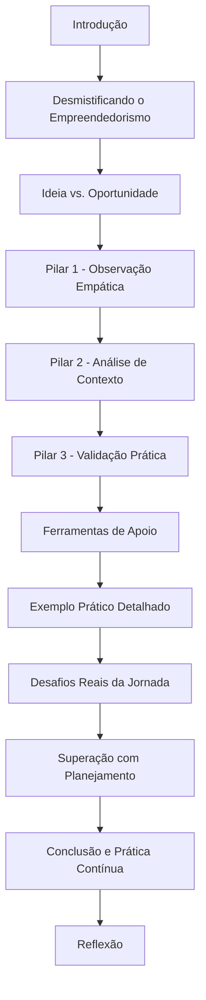

# Diagrama didático

```mermaid
flowchart TD
    S1[Introdução] --> S2[Desmistificando o Empreendedorismo]
    S2 --> S3[Ideia vs. Oportunidade]
    S3 --> S4[Pilar 1 - Observação Empática]
    S4 --> S5[Pilar 2 - Análise de Contexto]
    S5 --> S6[Pilar 3 - Validação Prática]
    S6 --> S7[Ferramentas de Apoio]
    S7 --> S8[Exemplo Prático Detalhado]
    S8 --> S9[Desafios Reais da Jornada]
    S9 --> S10[Superação com Planejamento]
    S10 --> S11[Conclusão e Prática Contínua]
    S11 --> S12[Reflexão]
```
