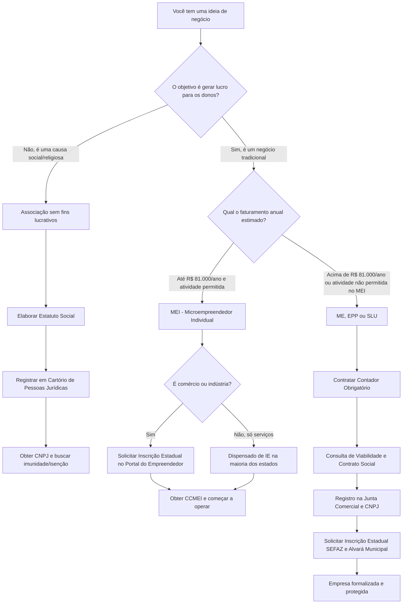

# 📘 Guia Prático das Formas Jurídicas no Brasil
*Do MEI às Associações: um passo a passo para formalizar seu negócio com segurança.*

## 🎯 Introdução: Por que este tutorial existe?
Muitos empreendedores travam na hora de formalizar porque a linguagem jurídica parece um "idioma estrangeiro". Este tutorial foi criado para traduzir esse idioma. Vamos caminhar juntos, do tipo mais simples (MEI) até estruturas mais complexas (ME, ONGs e Igrejas), sempre respondendo à pergunta: **"O que eu preciso fazer agora?"**.

> 💡 **Dica de Ouro:** A formalização não é um favor que você faz ao governo, é um blindagem que você constrói para o seu patrimônio e para a credibilidade do seu negócio.

---

## 🟢 Módulo 1: O Ponto de Partida – MEI (Microempreendedor Individual)

O MEI é a porta de entrada para mais de 15 milhões de brasileiros. É ideal para quem trabalha por conta própria e fatura até o limite anual vigente (atualmente **R$ 81.000,00/ano**, o que dá uma média de R$ 6.750,00/mês).

### 🔍 O MEI precisa de Inscrição Estadual (IE)?
**Depende da sua atividade:**
- **COMÉRCIO ou INDÚSTRIA:** **SIM, é obrigatório.** Se você vende produtos (ex: loja de roupas, fabricação de bolos para revenda), você precisa da IE para emitir nota fiscal de venda de mercadorias. O próprio portal do MEI solicita essa inscrição automaticamente em muitos estados.
- **PRESTAÇÃO DE SERVIÇOS:** **GERALMENTE NÃO.** A maioria dos estados dispensa o MEI prestador de serviços (ex: diarista, designer, professor particular) da Inscrição Estadual. O CNPJ e a Inscrição Municipal (quando exigida) são suficientes. 
> ⚠️ **Atenção:** Alguns poucos estados exigem IE mesmo para serviços. Sempre confirme no site da Secretaria da Fazenda (SEFAZ) do seu estado.

### 🛠️ Passo a Passo para abrir um MEI
1. **Acesse o Portal Oficial:** Entre no [Portal do Empreendedor (gov.br/mei)](https://www.gov.br/empresas-e-negocios/pt-br/empreendedor). *Nunca pague por sites intermediários; o serviço é 100% gratuito.*
2. **Faça login:** Utilize sua conta **Gov.br** (nível Prata ou Ouro).
3. **Formalize-se:** Clique em "Quero ser MEI" e depois em "Formalize-se".
4. **Preencha os dados:** Informe seus dados pessoais, endereço e escolha até 15 atividades (CNAEs), sendo 1 principal e até 14 secundárias.
5. **Finalize:** Ao concluir, você receberá imediatamente o **CCMEI** (Certificado da Condição de Microempreendedor Individual), que já contém seu CNPJ e, se for o caso, a solicitação da Inscrição Estadual.

---

## 🟡 Módulo 2: Quando Crescer – ME (Microempresa) e EPP

Quando o faturamento ultrapassa o limite do MEI, ou se a atividade não é permitida no MEI (ex: médicos, advogados, desenvolvedores de software em alguns casos), o caminho é abrir uma **ME (Microempresa)**, que fatura até R$ 360.000,00/ano, ou **EPP (Empresa de Pequeno Porte)**, até R$ 4,8 milhões/ano.

### 🔍 A Inscrição Estadual na ME/EPP
- **Obrigatória** para comércio, indústria, transporte interestadual/intermunicipal e comunicação.
- **Dispensada** para empresas que prestam *apenas* serviços que não envolvam circulação de mercadorias (embora o contador deva sempre analisar o CNAE específico).

### 🛠️ Passo a Passo para abrir uma ME/EPP
1. **Contrate um Contador:** Esta etapa é **obrigatória por lei** para ME e EPP. Ele será seu guia.
2. **Consulta de Viabilidade:** O contador verifica na Junta Comercial e na Prefeitura se o nome da empresa está disponível e se o endereço permite aquela atividade.
3. **Elaboração do Contrato Social:** Documento que define as regras do jogo (sócios, capital, responsabilidades).
4. **Registro na Junta Comercial:** Formaliza a existência legal da empresa.
5. **CNPJ na Receita Federal:** Obtenção do Cadastro Nacional.
6. **Inscrição Estadual (SEFAZ) e Municipal (Prefeitura):** O contador solicita as inscrições para que a empresa possa operar e emitir notas.
7. **Alvará de Funcionamento:** Emitido pela prefeitura, autoriza o local a funcionar.

> 💡 **Dica Prática:** Se você quer empreender sozinho, sem sócios, e não se encaixa no MEI, peça ao seu contador para abrir uma **SLU (Sociedade Limitada Unipessoal)**. Ela protege seu patrimônio pessoal sem exigir um sócio "laranja".

---

## 🔵 Módulo 3: Empreendedorismo Social e Religioso (ONGs e Igrejas)

Nem todo empreendimento visa o lucro financeiro para distribuição aos donos. O "Terceiro Setor" possui regras próprias e benefícios fiscais importantes.

### 1. ONGs (Organizações Não Governamentais)
Juridicamente, a maioria das ONGs é constituída como **Associação** (união de pessoas para um fim não econômico).
- **Característica principal:** Não há distribuição de lucros ou dividendos. Todo o recurso é reinvestido na causa.
- **Tributação:** Podem solicitar isenção de diversos impostos (como IR e CSLL), mas **não são automaticamente isentas**. É preciso seguir ritos específicos na Receita Federal.
- **Passo a Passo Básico:**
  1. Reunião dos fundadores e elaboração do **Estatuto Social** (regras da associação).
  2. Registro do Estatuto no Cartório de Registro de Pessoas Jurídicas.
  3. Obtenção do CNPJ na Receita Federal.
  4. Registro no Conselho Municipal de Direitos (se aplicável à causa, ex: assistência social).

### 2. Igrejas e Organizações Religiosas
Juridicamente, também são organizadas como **Associações Religiosas**.
- **O Grande Diferencial (Imunidade Tributária):** A Constituição Federal (Art. 150, VI, 'b') garante **imunidade** de impostos sobre patrimônio, renda e serviços relacionados às suas finalidades essenciais. 
- **Atenção:** A imunidade não é isenção automática; ela precisa ser reconhecida. Além disso, se a igreja abrir uma **livraria** ou **escola** que compete com o mercado, essa atividade específica pode ser tributada normalmente.
- **Passo a Passo Básico:**
  1. Elaboração do Estatuto Social, definindo a confissão religiosa e a gestão.
  2. Registro em Cartório de Pessoas Jurídicas.
  3. Obtenção do CNPJ.
  4. Solicitação formal do reconhecimento da imunidade tributária junto à Receita Federal e às Fazendas Estadual/Municipal.

> ⚠️ **Erro Comum:** Achar que, por ser igreja ou ONG, não precisa de contador ou de emitir nota fiscal. A obrigação de prestar contas (obrigações acessórias) existe para todos os CNPJs. A transparência é a base da credibilidade.

---

## 🗺️ Módulo 4: O Mapa da Inscrição Estadual (IE)

Para tirar de vez a dúvida, use este guia rápido:

| Tipo de Negócio | Precisa de Inscrição Estadual (IE)? | Por quê? |
| :--- | :---: | :--- |
| **MEI Comerciante** | ✅ **SIM** | Para emitir NF-e de venda de mercadorias. |
| **MEI Industrial** | ✅ **SIM** | Para emitir NF-e de produtos industrializados. |
| **MEI Prestador de Serviços** | ❌ **NÃO** (na maioria dos estados) | A tributação é municipal (ISS), não estadual (ICMS). |
| **ME/EPP de Comércio** | ✅ **SIM** | Obrigatório para operação legal e emissão de notas. |
| **ME/EPP de Serviços** | ⚠️ **DEPENDE** | Se houver circulação de mercadorias ou transporte interestadual, sim. Caso contrário, geralmente não. |
| **ONG / Igreja** | ❌ **NÃO** (regra geral) | Salvo se realizarem atividades econômicas específicas que gerem fato gerador de ICMS. |

---

## 🔄 Módulo 5: Fluxograma de Decisão Jurídica

Use este diagrama para visualizar o caminho ideal para o seu projeto:

---

## 📌 Checklist Final e Próximos Passos

Antes de dar o próximo passo, marque as caixas abaixo:

- [ ] **Defini minha atividade principal (CNAE).** (Isso define meus impostos).
- [ ] **Pesquisei se minha atividade é permitida no MEI.** (Lista oficial no Portal do Empreendedor).
- [ ] **Verifiquei a regra da Inscrição Estadual no site da SEFAZ do meu estado.**
- [ ] **Se for ME/EPP/ONG, já conversei com pelo menos dois contadores para orçar e tirar dúvidas.**
- [ ] **Separei meus documentos pessoais (RG, CPF, Comprovante de Residência) e defini um endereço para a empresa.**

### 🔗 Links Oficiais e Confiáveis para Consulta
- **Portal do Empreendedor (MEI):** [www.gov.br/empresas-e-negocios/pt-br/empreendedor](https://www.gov.br/empresas-e-negocios/pt-br/empreendedor)
- **Redesim (Integração de Registro de Empresas):** [www.gov.br/receitafederal/pt-br/assuntos/orientacao-tributaria/cadastros/consultas/rede-sim](https://www.gov.br/receitafederal/pt-br/assuntos/orientacao-tributaria/cadastros/consultas/rede-sim)
- **Classificação Nacional de Atividades Econômicas (CNAE):** [cnae.ibge.gov.br](https://cnae.ibge.gov.br/)

> 🚀 **Mensagem Final:** A burocracia é apenas um processo. Quando você entende o "porquê" de cada etapa (proteção, organização, credibilidade), ela deixa de ser um obstáculo e se torna a primeira vitória do seu empreendimento. Comece pelo passo que você pode dar hoje!
