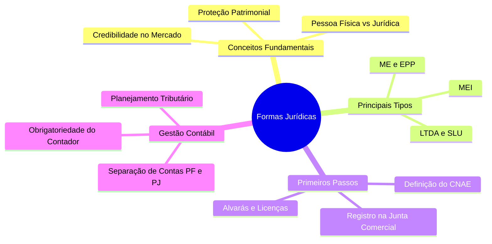

# MAPA MENTAL

```mermaid
mindmap
  root((Formas Jurídicas))
    Conceitos Fundamentais
      Pessoa Física vs Jurídica
      Proteção Patrimonial
      Credibilidade no Mercado
    Principais Tipos
      MEI
      ME e EPP
      LTDA e SLU
    Primeiros Passos
      Definição do CNAE
      Registro na Junta Comercial
      Alvarás e Licenças
    Gestão Contábil
      Obrigatoriedade do Contador
      Separação de Contas PF e PJ
      Planejamento Tributário
```
