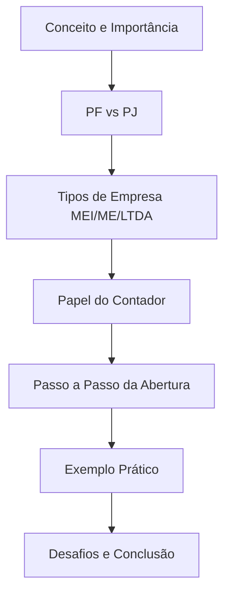

# SLIDES

```mermaid
flowchart TD
  A[Conceito e Importância] --> B[PF vs PJ]
  B --> C[Tipos de Empresa MEI/ME/LTDA]
  C --> D[Papel do Contador]
  D --> E[Passo a Passo da Abertura]
  E --> F[Exemplo Prático]
  F --> G[Desafios e Conclusão]
```
