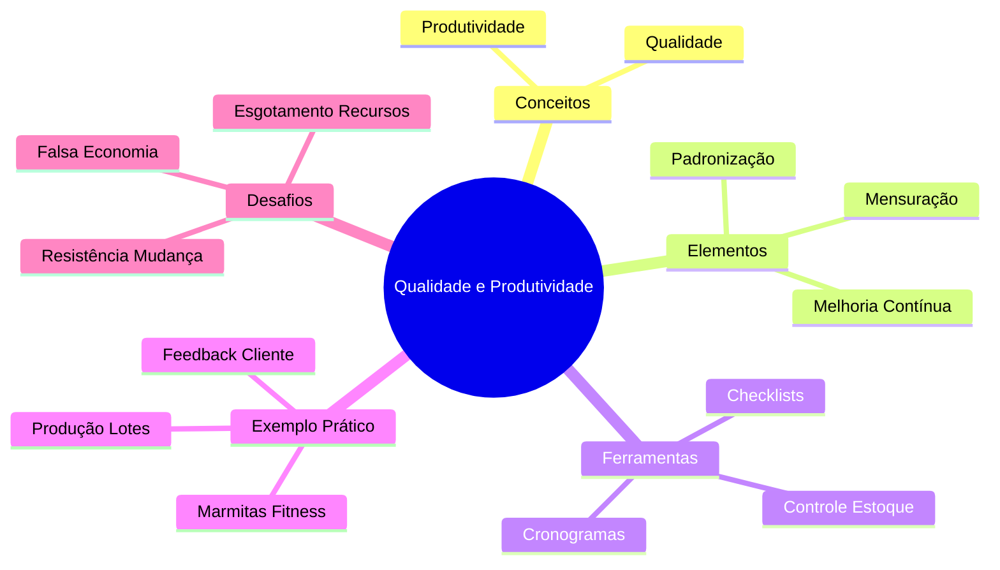

# MAPA MENTAL

```mermaid
mindmap
  root((Qualidade e Produtividade))
    Conceitos
      Qualidade
      Produtividade
    Elementos
      Padronização
      Mensuração
      Melhoria Contínua
    Ferramentas
      Checklists
      Cronogramas
      Controle Estoque
    Exemplo Prático
      Marmitas Fitness
      Produção Lotes
      Feedback Cliente
    Desafios
      Falsa Economia
      Resistência Mudança
      Esgotamento Recursos
```

