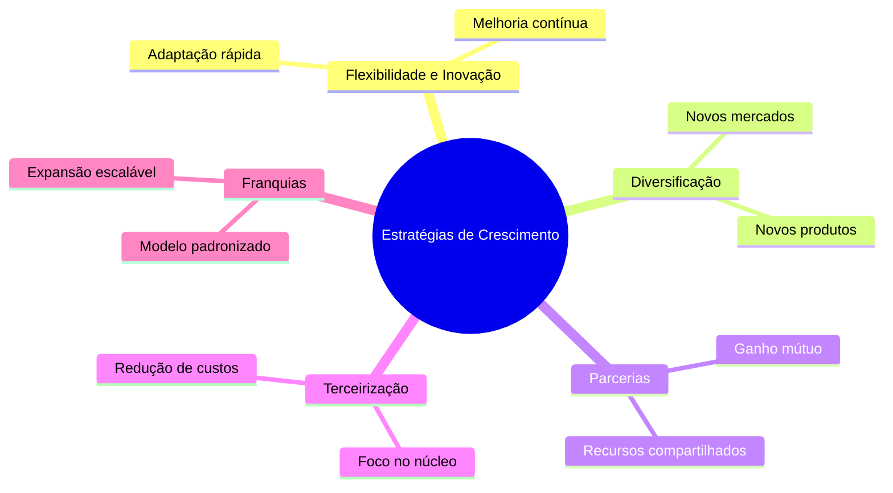

# MAPA MENTAL

```mermaid
mindmap
  root((Estratégias de Crescimento))
    Flexibilidade e Inovação
      Adaptação rápida
      Melhoria contínua
    Diversificação
      Novos produtos
      Novos mercados
    Parcerias
      Ganho mútuo
      Recursos compartilhados
    Terceirização
      Foco no núcleo
      Redução de custos
    Franquias
      Expansão escalável
      Modelo padronizado
```

