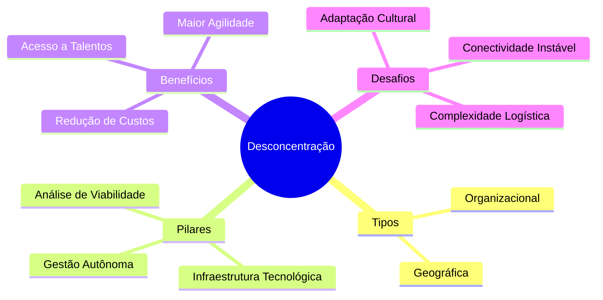

# MAPA MENTAL

```mermaid
mindmap
  root((Desconcentração))
    Tipos
      Geográfica
      Organizacional
    Pilares
      Análise de Viabilidade
      Infraestrutura Tecnológica
      Gestão Autônoma
    Benefícios
      Redução de Custos
      Acesso a Talentos
      Maior Agilidade
    Desafios
      Conectividade Instável
      Adaptação Cultural
      Complexidade Logística
```

