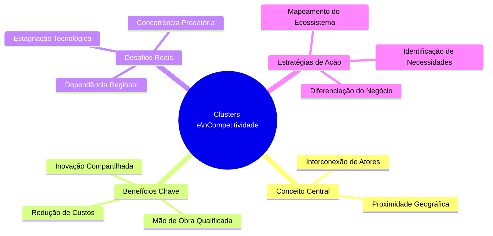

# MAPA MENTAL

```mermaid
mindmap
  root((Clusters e\nCompetitividade))
    Conceito Central
      Proximidade Geográfica
      Interconexão de Atores
    Benefícios Chave
      Redução de Custos
      Inovação Compartilhada
      Mão de Obra Qualificada
    Desafios Reais
      Dependência Regional
      Estagnação Tecnológica
      Concorrência Predatória
    Estratégias de Ação
      Mapeamento do Ecossistema
      Identificação de Necessidades
      Diferenciação do Negócio
```
