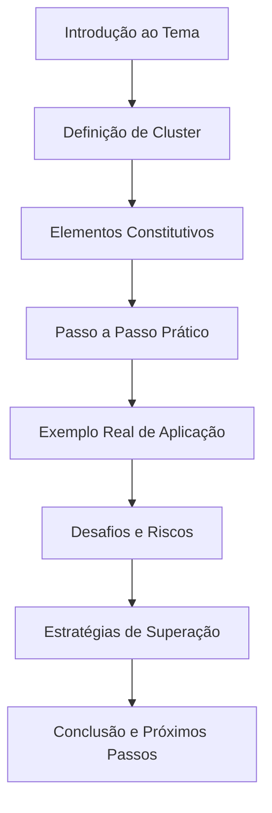

### Diagrama Final: Sequência Lógica da Apresentação

```mermaid
flowchart TD
    A[Introdução ao Tema] --> B[Definição de Cluster]
    B --> C[Elementos Constitutivos]
    C --> D[Passo a Passo Prático]
    D --> E[Exemplo Real de Aplicação]
    E --> F[Desafios e Riscos]
    F --> G[Estratégias de Superação]
    G --> H[Conclusão e Próximos Passos]
```
