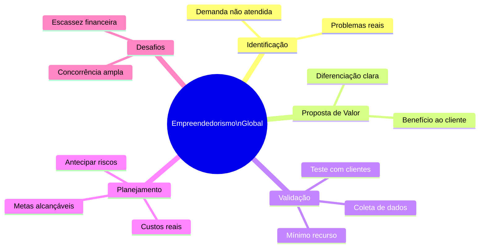

## MAPA MENTAL

```mermaid
mindmap
  root((Empreendedorismo\nGlobal))
    Identificação
      Problemas reais
      Demanda não atendida
    Proposta de Valor
      Diferenciação clara
      Benefício ao cliente
    Validação
      Teste com clientes
      Mínimo recurso
      Coleta de dados
    Planejamento
      Antecipar riscos
      Custos reais
      Metas alcançáveis
    Desafios
      Concorrência ampla
      Escassez financeira
```
