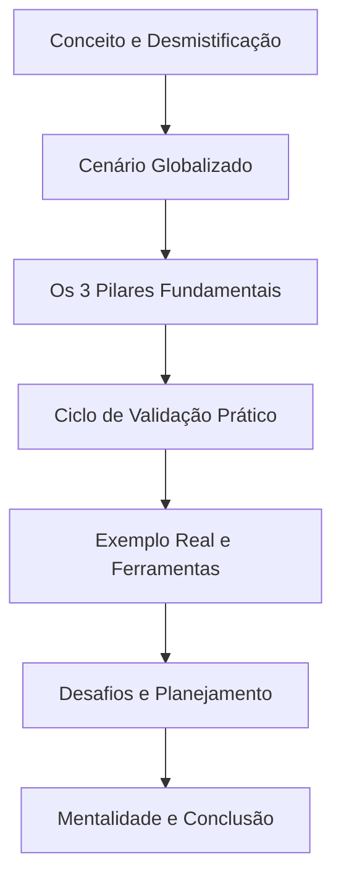

### Slides: Sequência Lógica da Apresentação

```mermaid
flowchart TD
  A[Conceito e Desmistificação] --> B[Cenário Globalizado]
  B --> C[Os 3 Pilares Fundamentais]
  C --> D[Ciclo de Validação Prático]
  D --> E[Exemplo Real e Ferramentas]
  E --> F[Desafios e Planejamento]
  F --> G[Mentalidade e Conclusão]
```
